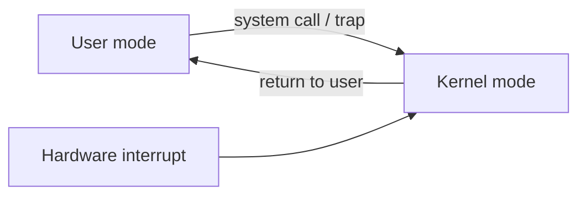

# Chapter 1 — Introduction (Operating System Concepts, 10e)

These notes are **original** (not copied from the book/slides). They’re optimized for **OS theory exams** where you get:
- definition/compare questions (2–5 marks)
- long explanations (8–12 marks)
- a few small numericals/derivations (usually CPU utilization with multiprogramming)

If a section is typically low-yield, it is kept short.

---

## 0) What to prioritize (exam map)

**Very high yield (write in detail):**
- OS definition + goals (convenience/efficiency/evolution)
- interrupts vs traps/exceptions vs system calls
- dual-mode (user/kernel), privileged instructions, timer
- system-call path (user → kernel → user)
- DMA vs programmed I/O
- storage hierarchy + caching + locality (conceptual)
- multiprogramming utilization derivation: $U = 1 - p^n$

**Medium yield:**
- multiprocessor basics (why multi-core matters)
- kernel vs shell distinction

**Low yield in many theory exams (short overview is enough):**
- OS structures (monolithic/layered/microkernel/modules) in Chapter 1 level
- virtualization/cloud (usually 2–3 lines)

---

## 1) What is an Operating System?

**Operating System (OS):** system software that **manages hardware resources** and provides **services/abstractions** so programs can run safely and efficiently.

Two standard viewpoints (often asked):
- **Resource allocator:** decides how CPU, memory, devices, and storage are shared.
- **Control program:** enforces correct usage (protection, isolation, error handling).

**Kernel** = the core part of the OS that runs in privileged mode.
**Shell / UI** = the user-facing layer (CLI/GUI) that *uses* OS services; not the “whole OS”.

---

## 2) Computer-system organization (CPU + devices) — high yield

A basic computer system:
- CPU(s) + caches
- main memory (RAM)
- device controllers (disk, NIC, USB, GPU) connected via buses
- each controller may have local buffer(s)

### Diagram: where OS fits

```mermaid
flowchart TB
  A[User Programs<br/>(browsers, editors, apps)] --> B[System Programs<br/>(compilers, shells)]
  B --> C[Operating System / Kernel]
  C --> D[Hardware<br/>CPU, Memory, Devices]
```

---

## 3) Interrupts, traps/exceptions, and system calls (must-master)

### 3.1 Definitions (2–4 marks)

- **Interrupt:** asynchronous event from hardware (I/O completion, timer tick).
- **Trap / Exception:** synchronous event generated by the CPU during execution (divide-by-zero, page fault, invalid opcode).
- **System call:** a *controlled* trap used by a program to request OS service.

**One-line differentiator (exam-friendly):**
- Interrupt = external & asynchronous
- Exception = internal & synchronous
- System call = intentional exception for OS service

### 3.2 Interrupt handling flow (long-question template)

```mermaid
sequenceDiagram
  participant Dev as Device
  participant CPU as CPU
  participant OS as "Kernel (ISR)"
  participant P as "Interrupted Program"

  P->>CPU: executing
  Dev-->>CPU: interrupt signal
  CPU->>CPU: save context + switch to kernel mode
  CPU->>OS: jump via interrupt vector
  OS->>OS: service device; update data structures
  OS-->>CPU: return-from-interrupt
  CPU->>P: restore context; resume
```

**Key marking points:**
- interrupt vector/table selects correct handler
- save/restore context
- kernel mode during handler

---

## 4) Dual mode, privileged instructions, and the timer (very high yield)

### 4.1 Dual-mode operation
- **User mode:** restricted; user programs run here.
- **Kernel mode:** privileged; OS runs here.

### 4.2 Privileged instructions (examples)
- direct device I/O operations
- enabling/disabling interrupts
- changing memory-management state (page tables, MMU settings)

### 4.3 Why the timer matters
A **timer interrupt** ensures the OS regains control even if a process:
- goes into an infinite loop
- refuses to yield

This enables **preemptive scheduling** and prevents CPU monopolization.

### Diagram: controlled entry to kernel



---

## 5) Storage hierarchy, caching, locality (conceptual high yield)

### 5.1 Storage hierarchy idea
Fast memory is expensive, slow memory is cheap, so systems use a hierarchy.

```mermaid
flowchart TB
  R[Registers<br/>fastest, smallest] --> C[CPU Cache (L1/L2/L3)]
  C --> M[Main Memory (RAM)]
  M --> S[Secondary Storage (SSD/HDD)]
  S --> A[Archive (tape/cloud)<br/>slowest, largest]
```

### 5.2 Caching + locality
- **Caching:** keep copies of frequently used data closer to CPU.
- **Temporal locality:** recently used items are likely to be used again soon.
- **Spatial locality:** nearby items are likely to be used soon.

**Typical theory question:** “Why does caching work?” → answer: locality.

---

## 6) I/O structure and DMA (asked often)

### 6.1 Programmed I/O (PIO)
CPU moves data itself (byte/word at a time).
- Pro: simple
- Con: wastes CPU cycles for large transfers

### 6.2 DMA (Direct Memory Access)
A DMA controller transfers a **block** between device and main memory.
- CPU sets up DMA (source, destination, size)
- DMA transfers block
- DMA interrupts CPU on completion

```mermaid
flowchart LR
  CPU[CPU] -->|1) program DMA| DMA[DMA Controller]
  DMA -->|2) transfer block| MEM[Main Memory]
  DMA -->|2) transfer block| DEV[Device]
  DMA -->|3) interrupt on done| CPU
```

**Exam line:** DMA increases throughput by freeing CPU during bulk transfers.

---

## 7) Multiprogramming and time sharing (high yield)

- **Multiprogramming:** multiple jobs in memory; when one waits for I/O, CPU runs another → higher CPU utilization.
- **Time sharing (multitasking):** rapid switching to support interactivity; usually **preemptive**.

**Common compare point:**
- multiprogramming focuses on utilization
- time sharing focuses on responsiveness

---

## 8) Small numerical/derivation: CPU utilization with multiprogramming

**Problem model:**
- Each process is waiting for I/O with probability $p$.
- There are $n$ independent processes.
- CPU is idle only when **all** are waiting.

**Derivation (write exactly like this):**
- $P(\text{CPU idle}) = p^n$
- $U = 1 - P(\text{CPU idle}) = 1 - p^n$

So:

$$U = 1 - p^n$$

---

## 9) OS structure types (short overview)

In Chapter 1, you only need the gist:
- **Monolithic:** many services in kernel space → fast, large trusted base.
- **Layered:** layers with defined interfaces → cleaner, can add overhead.
- **Microkernel:** minimal kernel, services in user space → better isolation, IPC overhead.
- **Modules:** loadable kernel modules → flexible.

---

## 10) Virtualization + cloud (short overview)

- **Virtualization:** run multiple OS instances on same hardware using a **hypervisor**.
- **Cloud:** on-demand compute/storage; relies on virtualization + resource management.

---

## 11) “Write-this” answer templates (for long questions)

### Template A — Interrupts vs traps vs system calls
- definitions (3 lines)
- 2 examples each
- handler flow (interrupt vector, save/restore context)
- why they matter (I/O efficiency + protection)

### Template B — Dual mode + timer for protection
- define user/kernel
- privileged instructions examples
- timer ensures preemption
- conclude with: prevents user takeover + improves stability

---

## 12) Extra practice references (optional)

These links are for *practice and cross-checking*, not for copying:
- OS intro: https://www.geeksforgeeks.org/introduction-of-operating-system-set-1/
- Cache/locality: https://www.geeksforgeeks.org/cache-memory-in-computer-organization/
