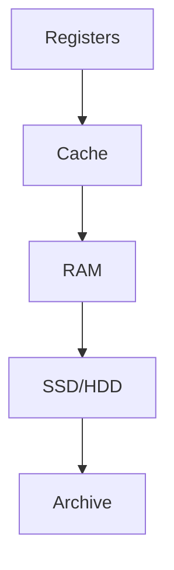

# Chapter 1 — Fully Solved Exam Questions (Theory + Numericals + “Algorithms”)

All questions below include **complete answers/solutions** (no unsolved section), with an exam-friendly structure.

---

## Beginner shortcuts (layman + mnemonics)

- How to score marks fast: write the definition in 1 line, then 3-5 crisp bullets, then a tiny example if possible.
- In one line: OS is the BOSS that manages hardware and lets apps run safely.
- Mnemonic: BOSS = Bridge (apps-hardware), Organize (CPU/mem/I-O), Secure (protection), Serve (system calls).
- Common mistakes: skipping the rule-set/assumptions, mixing symbols, and not showing steps in numericals.
- If a numerical exists: write Given -> Table/Diagram -> Steps -> Final Answer (boxed).

## A) Very Short (1–2 marks) — Solved

### Q1) What is the kernel?
**Answer:** The kernel is the core part of the operating system that runs in privileged mode and manages CPU, memory, and device operations.

### Q2) Define interrupt.
**Answer:** An interrupt is a hardware signal/event that temporarily stops the CPU’s current flow so the OS can run a handler (e.g., timer tick, I/O completion).

### Q3) Define system call.
**Answer:** A system call is the controlled interface through which a user program requests a service from the OS (implemented using a trap/exception).

---

## B) Short (3–5 marks) — Solved

### Q4) Differentiate interrupt, exception (trap), and system call.
**Answer (write in 3 bullets):**
- **Interrupt:** external to the running instruction stream; typically asynchronous (device, timer).
- **Exception/Trap:** raised by CPU as a direct result of executing an instruction; synchronous (divide-by-zero, page fault).
- **System call:** an intentional trap used to request OS services (file read, process creation).

### Q5) Why do we need dual-mode operation?
**Answer:**
- Dual mode separates **user mode** from **kernel mode**.
- Prevents user programs from executing privileged instructions (e.g., direct I/O, changing page tables).
- Ensures protection and system stability by controlling access to hardware resources.

### Q6) Why is a timer needed in an OS?
**Answer:**
- The OS programs a timer to generate interrupts periodically.
- Guarantees that the OS regains control, enabling preemptive scheduling.
- Prevents any program from monopolizing the CPU (e.g., infinite loops).

### Q7) Explain DMA and one advantage over programmed I/O.
**Answer:**
- **DMA** transfers blocks of data between device and RAM using a DMA controller.
- **Advantage:** CPU does not move every byte/word, so CPU time is saved and throughput improves.

---

## C) Long (8–12 marks) — Solved “Model Answers”

### Q8) Explain interrupt handling in an operating system.
**Model answer:**
1. **Definition:** An interrupt is a signal/event that causes the CPU to pause current execution and run an OS handler.
2. **Step-by-step handling:**
   - A device or timer triggers an interrupt.
   - CPU saves minimal context (program counter, flags; details depend on architecture).
   - CPU switches to kernel mode.
   - OS uses an **interrupt vector/table** to locate the correct interrupt service routine (ISR).
   - ISR services the event (e.g., acknowledges device, moves status/data, wakes blocked process).
   - OS restores context and returns to the interrupted program.
3. **Why it’s important:** enables efficient I/O and supports time sharing (timer interrupts).

### Q9) Explain how a system call is executed (user → kernel → user).
**Model answer:**
1. **Definition:** System calls provide controlled access to OS services.
2. **Execution path:**
   - User program calls an API/wrapper (library routine).
   - Wrapper places syscall number and arguments in registers/stack.
   - A trap instruction transfers control to the kernel and switches to kernel mode.
   - Kernel validates the request (permissions, arguments), performs the service.
   - Kernel returns a result code; CPU returns to user mode.
3. **Why needed:** direct access to devices/memory would break protection and reliability.

---

## D) Numericals / Derivations — Fully Solved

### Q10) Multiprogramming CPU utilization derivation
**Question:** If each process waits for I/O with probability $p$ and there are $n$ independent processes in memory, derive CPU utilization $U$.

**Method (show these lines):**
1. CPU is idle only if **all** processes are waiting.
2. $P(\text{all waiting}) = p^n$
3. $U = 1 - P(\text{CPU idle}) = 1 - p^n$

**Final:**
$$U = 1 - p^n$$

### Q11) Numerical example using $U = 1 - p^n$
**Question:** $p = 0.7$, $n = 3$. Find utilization.

**Solution:**
- $p^n = 0.7^3 = 0.343$
- $U = 1 - 0.343 = 0.657$

**Answer:** $U = 0.657$ → **65.7%**.

### Q12) Compare utilization for two choices of multiprogramming degree
**Question:** $p = 0.6$. Compare $n=2$ vs $n=5$.

**Solution:**
- For $n=2$: $U = 1 - 0.6^2 = 1 - 0.36 = 0.64$ → **64%**
- For $n=5$: $U = 1 - 0.6^5 = 1 - 0.07776 = 0.92224$ → **92.224%**

**Conclusion:** Larger $n$ increases utilization (under independence assumption).

---

## E) “Algorithms” (pseudocode) — Complete + Explained

Chapter 1 doesn’t have heavy algorithms like CPU scheduling or deadlock detection, but exams often ask the **procedural flow** of interrupts and system calls. These are written as “algorithms” you can reproduce.

### Q13) Algorithm: Interrupt dispatch and handling
**Question:** Write the algorithmic steps for handling an interrupt.

**Solution (pseudocode + explanation):**

**Pseudocode:**
```text
on_interrupt():
  save_minimal_cpu_state()
  switch_to_kernel_mode()
  irq = read_interrupt_number()
  handler = interrupt_vector[irq]
  handler()
  restore_cpu_state()
  return_from_interrupt()
```

**Explanation (what to write in theory exam):**
- Save state so the interrupted program can resume.
- Use interrupt vector to select correct ISR.
- Run ISR, then restore state and return.

### Q14) Algorithm: System call path
**Question:** Describe the algorithmic steps in executing a system call `read(fd, buf, n)`.

**Solution:**

**Pseudocode:**
```text
user_calls_read(fd, buf, n):
  place_args(fd, buf, n)
  place_syscall_number(READ)
  trap_to_kernel()

kernel_syscall_handler():
  save_user_context()
  validate_args_and_permissions()
  result = perform_read()
  set_return_value(result)
  restore_user_context()
  return_to_user_mode()
```

**What examiners look for:** controlled entry (trap), validation, return value.

---

## F) Diagram-based Questions — Solved

### Q15) Draw and explain dual-mode + controlled access.
**Answer (diagram + explanation):**

```mermaid
flowchart LR
  U[User Program<br/>(User Mode)] -- syscall/trap --> K[Kernel<br/>(Kernel Mode)]
  K -- return --> U
  D[Device / Timer] -- interrupt --> K
```

**Explanation:**
- User programs cannot execute privileged operations directly.
- They request services via syscalls (trap to kernel).
- Hardware interrupts also enter kernel so OS can handle I/O completion and enforce time sharing.

### Q16) Draw storage hierarchy and explain why caching helps.
**Answer:**



Caching helps because programs show **temporal and spatial locality**, so keeping frequently used data near CPU reduces average access time.

---

## G) Common “Tricky” Conceptual Questions — Solved

### Q17) Is the OS always running?
**Answer:** The kernel (or essential OS components) are always available; user programs come and go. The OS remains responsible for managing resources and handling interrupts/system calls.

### Q18) Why not let user programs directly do I/O?
**Answer:** It would break protection and reliability: a buggy or malicious program could corrupt devices, other programs’ data, or crash the system.

---

## H) Reference links (for practice)

- OS introduction overview: https://www.geeksforgeeks.org/introduction-of-operating-system-set-1/
- Cache/locality refresher (COA-side): https://www.geeksforgeeks.org/cache-memory-in-computer-organization/

(Use these to practice; don’t copy text into your exam.)
