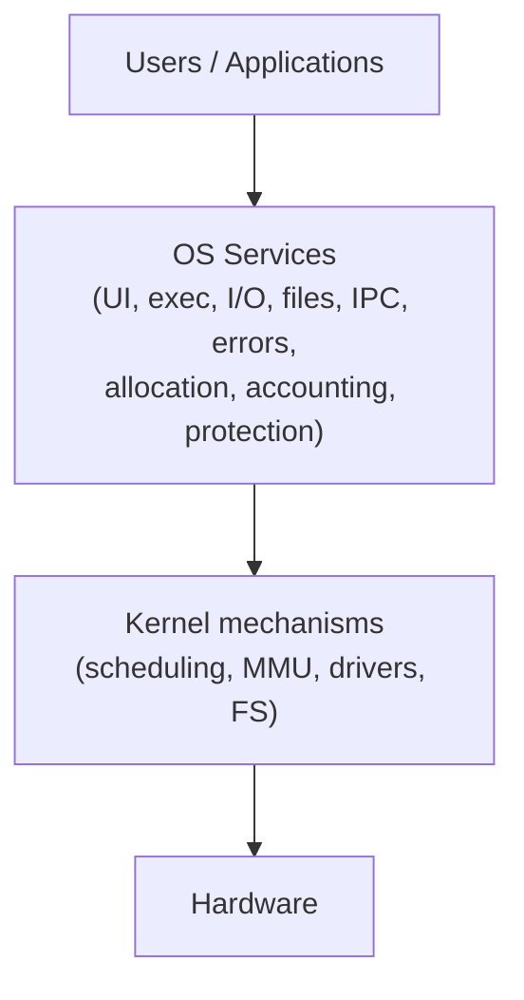
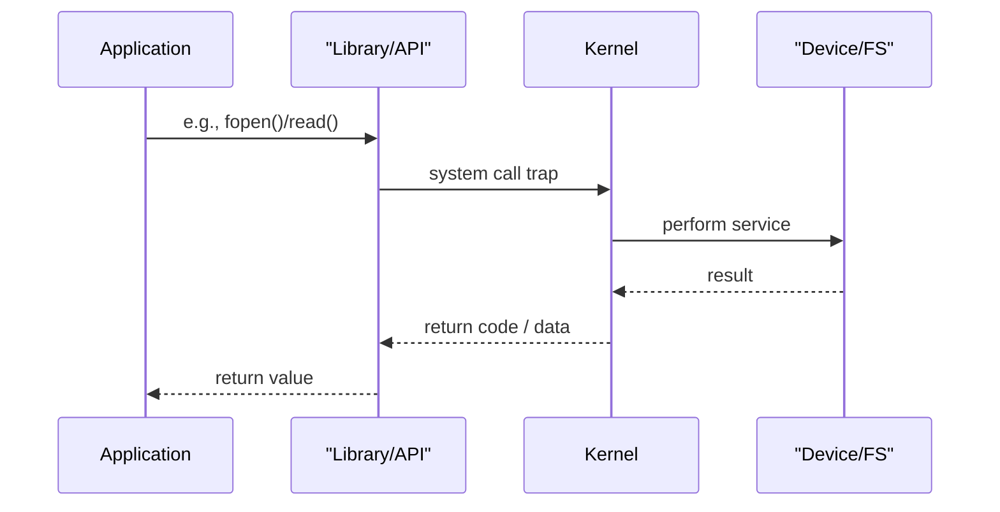
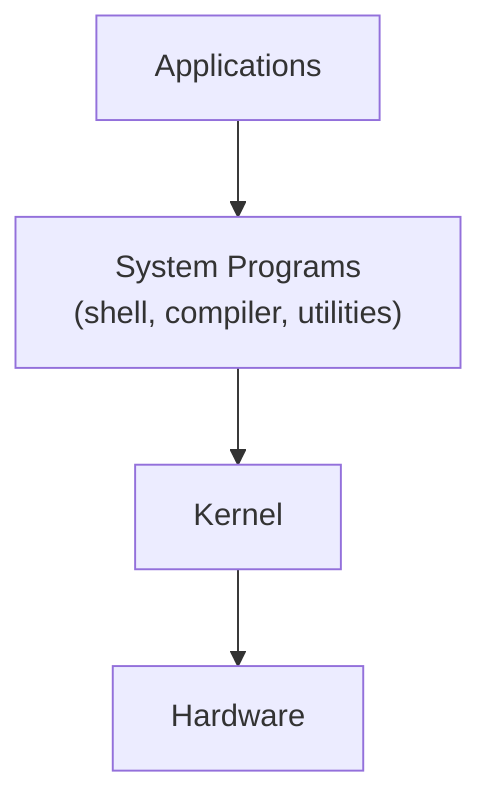
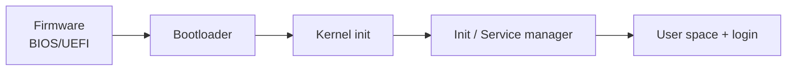

# Chapter 2 — Operating-System Services (Operating System Concepts, 10e)

These notes are **original** (not copied). Written for **theory exams**: definitions, compare/contrast, diagrams, and “write-up templates”.

---

## 0) What’s high-yield in this chapter

**Very high yield:**
- OS services list + explain with examples
- system-call concept + categories + the user→kernel path
- user interfaces: CLI vs GUI (short)
- system programs: categories + examples
- OS design goals (user goals vs system goals)
- OS boot process (basic steps)

**Medium yield:**
- APIs (POSIX/Win32/Java) vs system calls
- linking/loading (overview)

---

## 1) OS Services (core exam topic)

### The standard list (memorize)
OS provides services to **users** and **programs**:
1. **User interface** (CLI/GUI)
2. **Program execution** (load, run, terminate)
3. **I/O operations** (device read/write)
4. **File-system manipulation** (create/delete/read/write files & dirs)
5. **Communications** (IPC: shared memory, message passing, sockets)
6. **Error detection** (CPU, memory, I/O, file-system errors)
7. **Resource allocation** (CPU scheduling, memory, devices)
8. **Accounting** (usage tracking, quotas, logs)
9. **Protection & security** (access control, authentication, isolation)

### Diagram: services as a layer

### Quick explanations + examples (exam-ready)
- **Program execution:** `fork/exec` (Unix) or `CreateProcess` (Windows); process termination.
- **I/O operations:** read keyboard, write to screen, send network packet.
- **File-system manipulation:** open/close files, set permissions.
- **Communications:** pipe between processes, client-server via sockets.
- **Error detection:** handle page faults, disk read errors; log and recover.
- **Accounting:** per-user CPU time, disk usage.
- **Protection & security:** user vs kernel mode, permissions, authentication.

---

## 2) System Calls (most asked)

### 2.1 What is a system call?
A **system call** is a controlled entry into the kernel so a user program can request an OS service safely.

### 2.2 System call categories (memorize + 1–2 examples each)
- **Process control:** create/terminate/wait, signals
- **File management:** create/open/read/write/close
- **Device management:** request/release device, read/write
- **Information maintenance:** get time, get/set attributes
- **Communication:** pipes, sockets, shared memory
- **Protection:** permissions, access checks

### 2.3 Diagram: API vs system call vs kernel

**Exam line:** APIs hide syscall details and improve portability.

---

## 3) User interfaces (short but common)

- **CLI:** command line (bash, PowerShell). Powerful for scripting.
- **GUI:** windows/icons/menus. Better usability for general users.

---

## 4) System Programs (important definition + list)

System programs provide a convenient environment for development and execution.

Typical categories:
- **File management:** copy, move, list, search
- **Status information:** date, system info, performance monitor
- **File modification:** editors
- **Programming-language support:** compilers, interpreters, assemblers
- **Program loading and execution:** loaders, linkers
- **Communications:** email, remote login, browsers
- **Background services (daemons/services):** printing, scheduling tasks

### Diagram: where system programs sit

---

## 5) OS Design & Implementation (theory answers)

### 5.1 Design goals
- **User goals:** easy to use, reliable, fast, safe
- **System goals:** easy to design/implement/maintain, flexible, efficient

### 5.2 Mechanisms vs policies (very exam-friendly)
- **Mechanism:** *how* to do something (e.g., context switch code)
- **Policy:** *what* decision to make (e.g., which process runs next)

Why separate them?
- changing policy is easier if mechanism is stable

### 5.3 Implementation overview
- Mostly in **C/C++** for performance + low-level control; some assembly for boot/interrupt entry.

---

## 6) OS Structure (overview here)

- **Monolithic:** big kernel, fast system calls
- **Layered:** clean separation
- **Microkernel:** minimal kernel + user-space services
- **Modules:** loadable components

(Details may appear again later; keep this section short in Chapter 2 answers unless asked.)

---

## 7) System Boot (often a 5-mark question)

### Typical boot steps (generic)
1. Firmware (BIOS/UEFI) initializes hardware
2. Locates boot device and loads bootloader
3. Bootloader loads kernel into memory
4. Kernel initializes drivers/subsystems
5. Starts first user-space process/service manager

---

## 8) Write-up templates (copy for exam answers)

### Template A — “Explain OS services” (8–10 marks)
- Define OS services
- List the 9 services
- Explain 5–6 with examples
- Conclude: services provide convenience + efficiency + protection

### Template B — “System call mechanism” (8–10 marks)
- Define syscall
- show user→API→trap→kernel→return
- mention validation + return code
- give categories + examples

