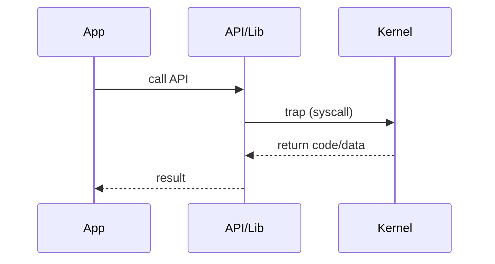

# Chapter 2 — Fully Solved Exam Questions (OS Services)

Every question here includes a complete answer. Use these as **write-up models**.

---

## A) Very Short (1–2 marks) — Solved

### Q1) What is an OS service?
**Answer:** An OS service is a facility provided by the operating system to help users/programs execute tasks conveniently and efficiently (e.g., file access, process execution, IPC).

### Q2) What is the difference between an API and a system call?
**Answer:** An API is a library-level interface used by programs (portable), while a system call is the actual kernel entry point that performs privileged OS services.

### Q3) What is the bootloader?
**Answer:** A bootloader is a small program loaded by firmware that loads the OS kernel into memory and transfers control to it.

---

## B) Short (3–5 marks) — Solved

### Q4) List any five operating-system services and explain briefly.
**Answer:**
- **Program execution:** loads a program into memory, runs it, terminates it.
- **I/O operations:** provides read/write access to devices through drivers.
- **File-system manipulation:** create/open/read/write/delete files and directories.
- **Communications (IPC):** enables processes to exchange data (pipes/sockets/shared memory).
- **Protection & security:** controls access to resources and isolates processes/users.

### Q5) Why are system calls needed? Why not allow direct device access from user programs?
**Answer:**
- Direct device access would break **protection** and **stability**: one bug could crash the system or corrupt data.
- System calls provide **controlled entry** to kernel mode where the OS can validate permissions and arguments.

### Q6) Explain “policy vs mechanism” with an example.
**Answer:**
- **Mechanism:** how something is done (e.g., context switch code).
- **Policy:** which choice to make (e.g., which process runs next).
**Example:** The mechanism saves/restores registers; the policy decides which process is selected by the scheduler.

---

## C) Long (8–12 marks) — Solved Model Answers

### Q7) Explain operating-system services. How do they help users and programs?
**Model answer:**
1. OS services provide an environment for program execution and user convenience.
2. Key services:
   - **User interface** (CLI/GUI)
   - **Program execution** (load/run/terminate)
   - **I/O operations** (device access via drivers)
   - **File-system manipulation**
   - **Communications (IPC)**
   - **Error detection** (CPU/memory/I/O)
   - **Resource allocation** (CPU, memory, devices)
   - **Accounting** (usage, quotas)
   - **Protection & security** (authentication/authorization/isolation)
3. Conclusion: Together they make systems usable, efficient, and safe.

### Q8) Describe how a system call is executed (include diagram/steps).
**Model answer:**
1. An application calls a library/API function.
2. The wrapper prepares a syscall number + arguments.
3. A trap instruction switches CPU to kernel mode.
4. Kernel handler validates, performs the service, sets return value.
5. Control returns to user mode.



**Key point:** controlled entry + validation provide protection.

---

## D) “Algorithms” — Complete Pseudocode + How to Write

### Q9) Algorithm: Generic system-call handling
**Question:** Write the algorithmic steps of system call handling.

**Solution:**
```text
UserProgram calls API(args)
API places syscall_number + args in registers/stack
TRAP instruction executes
CPU switches to kernel mode and jumps to syscall dispatcher
Dispatcher:
  save user context
  validate args & permissions
  call service routine
  set return value / errno
  restore context
Return-from-trap to user mode
API returns result to UserProgram
```

**Exam tip:** Always include “validate args & permissions”.

### Q10) Algorithm: Boot sequence (generic)
**Question:** Write the steps of system boot.

**Solution:**
```text
Power on
Firmware (BIOS/UEFI) initializes hardware (POST)
Firmware selects boot device
Load and start bootloader
Bootloader loads kernel into RAM
Kernel initializes: memory, scheduler, drivers, file systems
Kernel starts first user-space process/service manager
System reaches login/GUI
```

---

## E) Applied/Scenario Questions — Fully Solved

### Q11) A user program requests to read a file. Which OS services are involved?
**Answer:**
- **File-system manipulation:** locate file metadata, manage permissions.
- **I/O operations:** interact with disk controller via drivers.
- **Protection & security:** verify user permissions.
- **Error detection:** handle disk read errors, missing file, invalid descriptor.
- **Resource allocation:** schedule disk I/O and CPU time for the requesting process.

### Q12) CLI vs GUI: give two advantages of CLI.
**Answer:**
- CLI is efficient for automation via scripts.
- CLI can be faster for expert users and remote management.

---

## F) Small “Numerical-style” Questions (Chapter-appropriate)

Chapter 2 usually has fewer heavy numericals, but exams sometimes include overhead reasoning.

### Q13) If an app performs 1,000 system calls/second and each syscall costs 3 µs of CPU time (overhead), how much CPU time per second is spent on syscall overhead?
**Solution:**
- Overhead per second = $1000 \times 3\,\mu s = 3000\,\mu s$
- $3000\,\mu s = 3\,ms$

**Answer:** **3 ms per second** (i.e., 0.3% of a single CPU second).

### Q14) Same system, now 200,000 syscalls/second at 3 µs each. What overhead fraction of a CPU second?
**Solution:**
- Time = $200000 \times 3\,\mu s = 600000\,\mu s = 0.6\,s$

**Answer:** **0.6 CPU-seconds per second** → about **60%** of one core.

---

## G) Ready-to-memorize mini answers (common)

### Q15) Name two IPC methods.
**Answer:** Shared memory and message passing (e.g., sockets/pipes).

### Q16) What is accounting in OS?
**Answer:** Tracking resource usage (CPU time, memory, I/O, storage) for statistics, billing, or quotas.

