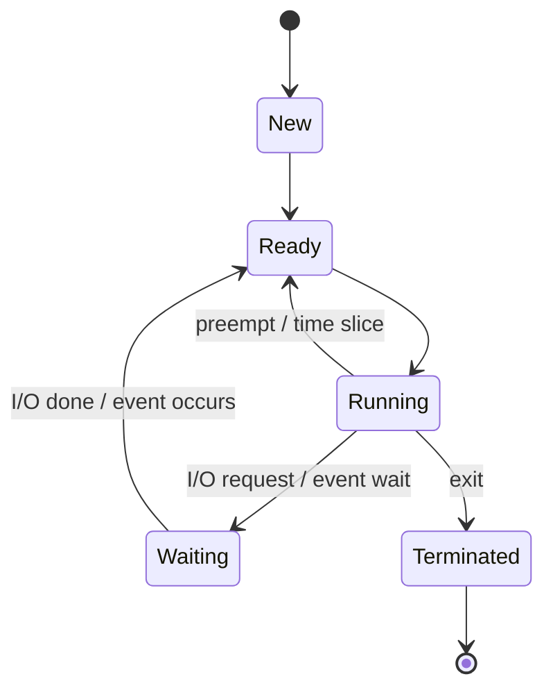
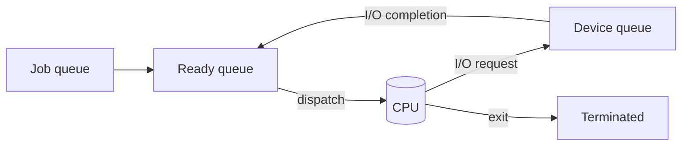
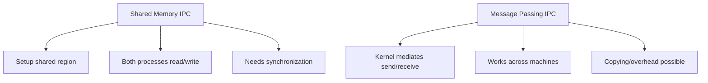

# Chapter 3 — Processes (Operating System Concepts, 10e)

Original, exam-focused notes (not copied). This chapter is **very high-yield**.

---

## Beginner shortcuts (layman + mnemonics)

- In one line: A process is a running program + its resources; OS tracks it using a PCB.
- Mnemonic: PCB = P-S-P-R-M-F = PID, State, Program counter, Registers, Memory info, Files.
- Common confusion: Program (file on disk) vs Process (running) vs Thread (execution path inside process).
- Exam keywords: states, context switch, scheduler, IPC, fork/exec, zombie/orphan.

## 0) What to prioritize

**Very high yield:**
- process concept, process states, PCB
- process scheduling queues
- context switch (what/why/cost)
- operations: create/terminate, parent/child
- IPC basics (shared memory vs message passing)
- client-server models (overview)

**Medium yield:**
- pipes, sockets (basic idea)
- zombie vs orphan

---

## 1) Process concept

**Process:** a program in execution + its current state + resources.

A process includes:
- code (text)
- data (globals, heap)
- stack
- CPU context (registers, program counter)
- OS-managed resources (open files, pending signals, etc.)

**Key exam line:** “Program is passive; process is active.”

---

## 2) Process states (must know diagram)

Common 5-state model:
- **New:** being created
- **Ready:** waiting for CPU
- **Running:** executing on CPU
- **Waiting/Blocked:** waiting for I/O/event
- **Terminated:** finished



**Exam tip:** mention that transitions are caused by scheduler decisions, interrupts, I/O completion.

---

## 3) PCB (Process Control Block) — very high yield

**PCB:** OS data structure that represents a process.

Typical PCB fields:
- process ID (PID)
- process state
- program counter
- CPU registers
- CPU scheduling info (priority, queue pointers)
- memory-management info (base/limit or page tables)
- accounting info (CPU time used)
- I/O status (open files, devices)

```mermaid
flowchart TB
  PCB[PCB]
  PCB --> PID[PID & State]
  PCB --> CPU[PC + Registers]
  PCB --> Sched[Priority + Queue links]
  PCB --> Mem[Memory info<br/>(page table / base-limit)]
  PCB --> IO[I/O info<br/>(open files, devices)]
  PCB --> Acc[Accounting<br/>(CPU time, owner)]
```

---

## 4) Scheduling queues

Processes move between queues:
- **Job queue:** all processes in the system
- **Ready queue:** in memory, ready to execute
- **Device queues:** waiting for specific device



---

## 5) Context switch (classic long question)

**Context switch:** saving the state of the current process and restoring the state of the next process.

What is saved/restored?
- registers
- program counter
- possibly MMU state (page-table base register)

**Why it matters:**
- it is pure overhead (no useful user work)
- frequent switching reduces throughput

---

## 6) Process creation and termination

### 6.1 Parent/child
- Creating a process creates a **parent-child** relationship.
- Resources may be shared or partitioned.

### 6.2 Typical Unix-style model
- `fork()` creates a new process (child) as a copy.
- `exec()` replaces process memory image with a new program.
- `wait()` lets parent wait for child termination.

### 6.3 Termination
- normal exit
- error exit
- killed by another process (permission-controlled)

**Zombie:** child finished but parent hasn’t collected exit status.
**Orphan:** parent terminated, child is adopted by init/system process.

---

## 7) Interprocess Communication (IPC)

Two major IPC models:

### 7.1 Shared memory
- fastest for large data (no kernel copying after setup)
- requires synchronization (mutex/semaphores)

### 7.2 Message passing
- `send(message)` / `receive(message)`
- simpler to reason about, good for distributed systems
- can be direct/indirect (mailboxes)



---

## 8) Client-server systems (overview)

- **Sockets:** endpoint for communication (common in networks).
- **RPC:** remote procedure call; call looks local but runs remotely.

Keep this short unless your exam focuses on networking.

---

## 9) Write-up templates

### Template A — “Explain process states + PCB” (10 marks)
- define process
- draw state diagram
- explain transitions
- define PCB + list fields
- conclude: PCB enables scheduling + management

### Template B — “Context switch” (8 marks)
- define
- steps (save/restore)
- why overhead
- mention interrupts and scheduling
