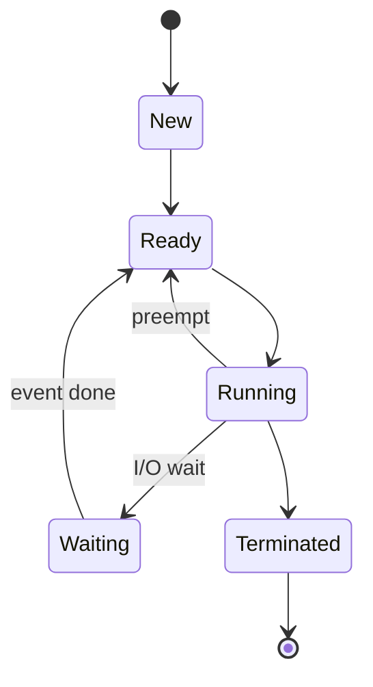
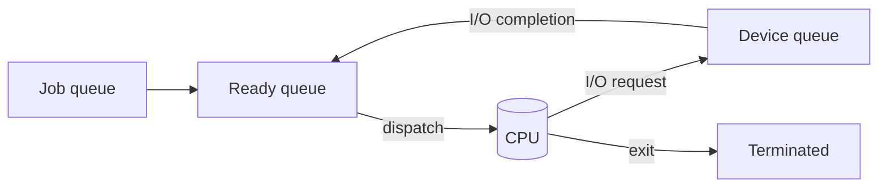

# Chapter 3 — Fully Solved Exam Questions (Processes)

All questions include complete answers/solutions.

---

## Beginner shortcuts (layman + mnemonics)

- How to score marks fast: write the definition in 1 line, then 3-5 crisp bullets, then a tiny example if possible.
- In one line: A process is a running program + its resources; OS tracks it using a PCB.
- Mnemonic: PCB = P-S-P-R-M-F = PID, State, Program counter, Registers, Memory info, Files.
- Common mistakes: skipping the rule-set/assumptions, mixing symbols, and not showing steps in numericals.
- If a numerical exists: write Given -> Table/Diagram -> Steps -> Final Answer (boxed).

## A) Very Short (1–2 marks) — Solved

### Q1) Define process.
**Answer:** A process is a program in execution along with its current CPU context, memory, and OS-managed resources.

### Q2) Define PCB.
**Answer:** PCB (Process Control Block) is the OS data structure that stores all information needed to manage and schedule a process (state, registers, memory info, etc.).

### Q3) What is a context switch?
**Answer:** A context switch is saving the state of one process and restoring the state of another so the CPU can switch execution.

---

## B) Short (3–5 marks) — Solved

### Q4) Draw and explain the main process states.
**Answer:**
- **New:** process is being created.
- **Ready:** in memory, waiting for CPU.
- **Running:** executing on CPU.
- **Waiting:** blocked for I/O or event.
- **Terminated:** finished.



### Q5) List PCB contents.
**Answer (scoring list):**
- PID and process state
- program counter and CPU registers
- scheduling info (priority, queue pointers)
- memory-management info (page table/base-limit)
- I/O status (open files, devices)
- accounting info

### Q6) Differentiate zombie and orphan process.
**Answer:**
- **Zombie:** child finished execution but parent hasn’t called `wait()` yet; entry remains for exit status.
- **Orphan:** parent terminates while child still runs; child is adopted by a system process.

---

## C) Long (8–12 marks) — Solved Model Answers

### Q7) Explain scheduling queues and process movement.
**Model answer:**
- The OS maintains queues for processes:
  - **Job queue:** all processes in system
  - **Ready queue:** in RAM and ready to run
  - **Device queues:** waiting for I/O devices
- Processes move between these queues based on CPU dispatch, I/O requests, and I/O completion interrupts.



### Q8) Explain context switching and why it is overhead.
**Model answer:**
1. Context switch occurs when the OS stops one process and starts another.
2. OS saves current process context (registers, PC, possibly MMU state) into its PCB.
3. OS loads next process context from its PCB.
4. The CPU resumes execution of the new process.

**Why overhead:** During save/restore, CPU does not execute useful user instructions; frequent switching reduces throughput.

---

## D) Algorithms (Pseudocode) — Complete + Explained

### Q9) Algorithm: Context switch steps
**Question:** Write algorithmic steps for a context switch.

**Solution:**
```text
context_switch(old, new):
  save CPU registers into old.PCB
  save old program counter into old.PCB
  save memory-management state if needed (e.g., page-table base)
  update old state (Ready/Waiting)

  load CPU registers from new.PCB
  load program counter from new.PCB
  load memory-management state
  set new state = Running
  return to new process
```

**Exam marker:** include “save/restore” + “update state”.

### Q10) Algorithm: Process creation (Unix-style fork/exec/wait)
**Question:** Give steps of creating and running a new program in Unix-like systems.

**Solution:**
```text
parent:
  pid = fork()
  if pid == 0:
    exec(new_program)
    exit(error_if_exec_fails)
  else:
    wait(pid)
```

**Explanation:** `fork()` duplicates; `exec()` replaces child image; `wait()` collects exit status.

---

## E) IPC Questions — Fully Solved

### Q11) Differentiate shared memory and message passing.
**Answer:**
- **Shared memory:** processes share a memory region; fast for large data; needs synchronization.
- **Message passing:** data exchanged via send/receive; simpler; works across machines; may have copying overhead.

### Q12) A producer and consumer share a buffer. Which IPC method is suitable and what else is required?
**Answer:** Shared memory is suitable for a shared buffer, but you must add synchronization (mutex/semaphore/monitor) to avoid race conditions.

---

## F) Small numerical-style / reasoning — Fully Solved

### Q13) If context switch takes 2 ms and happens 100 times per second, how much CPU time per second is lost to context switching?
**Solution:**
- Overhead = $100 \times 2\,ms = 200\,ms$ per second.

**Answer:** **200 ms per second** → 20% of one core.

### Q14) If a system reduces context switches from 200/s to 50/s (2 ms each), how much CPU time is saved per second?
**Solution:**
- Before: $200 \times 2ms = 400ms$
- After:  $50 \times 2ms = 100ms$
- Saved: $300ms$ per second

**Answer:** **300 ms per second saved**.
