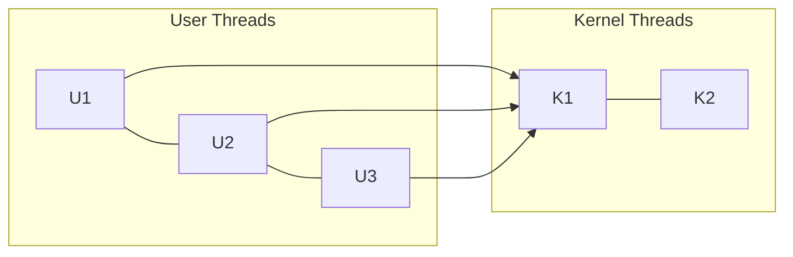

# Chapter 4 — Threads & Concurrency (Operating System Concepts, 10e)

Original, exam-focused notes (not copied). High-yield because exams love definitions + comparisons + diagrams.

---

## 0) What to prioritize

**Very high yield:**
- thread vs process
- benefits of multithreading
- user threads vs kernel threads
- multithreading models (many-to-one, one-to-one, many-to-many)
- concurrency problems: race condition, critical section (overview here; deep sync in Ch 6–7)

**Medium yield:**
- thread pools
- fork-join (concept)

---

## 1) Thread basics

**Thread:** the basic unit of CPU utilization (a sequence of execution) within a process.

A thread has:
- program counter
- register set
- stack

Threads in same process share:
- code
- data/heap
- open files

### Diagram: process vs threads
```mermaid
flowchart TB
  P[Process Address Space<br/>(code + data + heap + open files)]
  P --> T1[Thread 1<br/>PC+regs+stack]
  P --> T2[Thread 2<br/>PC+regs+stack]
  P --> T3[Thread 3<br/>PC+regs+stack]
```

### Thread vs process (classic compare)
- **Process:** heavier; separate address space; IPC needed.
- **Thread:** lighter; shared address space; needs synchronization for shared data.

---

## 2) Benefits of multithreading (memorize)

1. **Responsiveness:** UI stays responsive while background work runs.
2. **Resource sharing:** shared memory makes communication easier.
3. **Economy:** thread creation/switching cheaper than processes.
4. **Scalability:** can exploit multi-core systems.

---

## 3) User vs kernel threads

### User-level threads
- managed by a user-level library
- fast to create/switch
- BUT a blocking system call may block the entire process (depending on model)

### Kernel-level threads
- managed by OS
- better concurrency with blocking I/O and multi-core
- more overhead

---

## 4) Multithreading models (very high yield diagram)



### 4.1 Many-to-one
- many user threads mapped to one kernel thread
- fast but no true parallelism on multi-core; one blocking call blocks all

### 4.2 One-to-one
- each user thread mapped to a kernel thread
- true parallelism possible; higher overhead; OS may limit thread count

### 4.3 Many-to-many
- many user threads mapped to many kernel threads
- combines flexibility + parallelism; complex

---

## 5) Concurrency fundamentals (overview here)

### 5.1 Race condition
Occurs when the output depends on the unpredictable timing/interleaving of threads.

### 5.2 Critical section
Part of code that accesses shared data and must not be concurrently executed by multiple threads.

(Deep tools: mutex/semaphore/monitor are in later chapters.)

---

## 6) Thread pools (common short question)

Instead of creating/destroying threads repeatedly, a system maintains a pool of worker threads.
- reduces overhead
- improves responsiveness under load

---

## 7) Write-up templates

### Template A — “Thread vs process” (8 marks)
- define both
- list what a thread has
- shared vs private resources
- advantages + one risk (race condition)

### Template B — “Multithreading models” (10 marks)
- define user vs kernel threads
- draw mapping diagram(s)
- compare many-to-one, one-to-one, many-to-many
