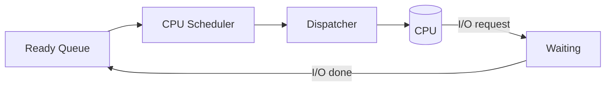

# Chapter 5 — CPU Scheduling (Operating System Concepts, 10e)

Original, exam-focused notes. This chapter is **the biggest numerical + algorithm chapter** in many OS theory exams.

---

## 0) What to prioritize

**Very high yield:**
- scheduling goals/criteria
- preemptive vs non-preemptive
- scheduling algorithms: FCFS, SJF, SRTF, Priority, RR
- Gantt chart numericals: waiting time (WT), turnaround time (TAT), response time (RT)
- starvation + aging

**Medium yield:**
- MLQ, MLFQ (often asked as theory)
- dispatcher + context switch

---

## 1) Basic terms (must memorize)

- **CPU burst:** time a process uses CPU before blocking/finishing.
- **I/O burst:** time waiting for I/O.
- **Preemptive:** OS can take CPU away (timer interrupt).
- **Non-preemptive:** running process keeps CPU until it blocks or finishes.

### Scheduling criteria
- **CPU utilization** (maximize)
- **Throughput** (maximize)
- **Turnaround time (TAT)** (minimize)
- **Waiting time (WT)** (minimize)
- **Response time (RT)** (minimize, for interactive)
- **Fairness** (avoid starvation)

### Definitions (use in numericals)
For each process $i$:
- $TAT_i = Completion_i - Arrival_i$
- $WT_i = TAT_i - Burst_i$
- $RT_i = FirstStart_i - Arrival_i$

---

## 2) Dispatcher + context switch (short theory)

- **Scheduler** selects next process.
- **Dispatcher** gives CPU to selected process (context switch + mode switch + jump to correct location).

---

## 3) Core scheduling algorithms (theory + behavior)

### 3.1 FCFS (First-Come First-Served)
- non-preemptive
- simple
- **convoy effect**: short jobs stuck behind long job

### 3.2 SJF (Shortest Job First)
- chooses smallest CPU burst
- optimal for average WT (under assumptions)
- can be non-preemptive or preemptive

### 3.3 SRTF (Shortest Remaining Time First)
- preemptive SJF
- if a new process arrives with shorter remaining time, it preempts

### 3.4 Priority scheduling
- highest priority runs first
- can be preemptive or non-preemptive
- **starvation** possible → fix with **aging** (increase priority over time)

### 3.5 Round Robin (RR)
- preemptive with time quantum $q$
- good response time
- too small $q$ → high context switch overhead; too large $q$ → FCFS-like

---

## 4) Multilevel queues (MLQ) (theory)

- Ready queue is partitioned (e.g., system, interactive, batch)
- Each queue may have its own scheduling algorithm
- Between queues: fixed priority or time-slice among queues

## 5) Multilevel feedback queue (MLFQ) (theory)

- processes can move between queues
- favors interactive (short CPU bursts) by keeping them high priority
- common rules:
  - if process uses full quantum → demote
  - if process yields early → stay/promote

---

## 6) How to solve scheduling numericals (exam method)

**Step-by-step method (write this before solving):**
1. List processes with Arrival (AT), Burst (BT), Priority (if any).
2. Choose algorithm and note if preemptive.
3. Build Gantt chart timeline.
4. Record first start time (for RT) and completion time.
5. Compute $TAT$, $WT$, $RT$ using formulas.
6. Compute averages.

---

## 7) Diagrams

### Ready queue to CPU

---

## 8) Write-up templates

### Template A — “Compare FCFS, SJF, RR” (10 marks)
- define each
- preemptive/non-preemptive
- pros/cons
- mention convoy effect (FCFS), starvation (SJF/priority), quantum tradeoff (RR)

### Template B — “Starvation and aging” (5 marks)
- define starvation
- show how aging gradually increases priority
