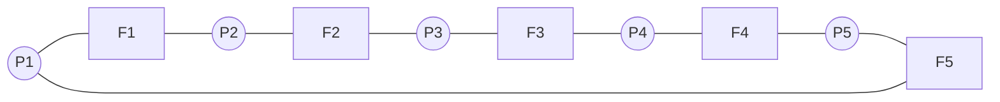

# Chapter 7 — Synchronization Examples (Operating System Concepts, 10e)

Original, exam-focused notes. This chapter is usually tested via **classic problems + complete solutions**.

---

## Beginner shortcuts (layman + mnemonics)

- In one line: Classic sync problems teach correct semaphore ordering (Producer-Consumer, Readers-Writers, Dining Philosophers).
- Mnemonic (Producer): wait(empty)->wait(mutex)->insert->signal(mutex)->signal(full).
- Mnemonic (Consumer): wait(full)->wait(mutex)->remove->signal(mutex)->signal(empty).
- Exam keywords: bounded buffer, read_count, starvation, deadlock avoidance in philosophers.

## 0) What to prioritize

**Very high yield:**
- bounded-buffer (producer-consumer)
- readers-writers (1st vs 2nd problem idea)
- dining philosophers
- sleeping barber (if taught)

---

## 1) Producer–Consumer (Bounded Buffer)

Problem: producers add items to a finite buffer; consumers remove items.

Typical correct tools:
- semaphores: `mutex`, `empty`, `full` (most common in exams)
- or monitors with conditions

---

## 2) Readers–Writers

Goal: allow multiple readers concurrently, but writers need exclusive access.

Two common variants:
- **Reader-preference:** readers may starve writers.
- **Writer-preference / fair:** avoid writer starvation.

---

## 3) Dining Philosophers

N philosophers alternate thinking/eating. Each needs two forks.

Naive approach deadlocks if all pick left fork then wait for right.

Common solutions:
- at most N−1 philosophers try to pick forks simultaneously
- resource ordering (always pick lower-numbered fork first)
- monitor solution

---

## 4) Diagrams (conceptual)

### Bounded buffer semaphores
```mermaid
flowchart LR
  P[Producer] -->|wait(empty)| M[mutex]
  M -->|insert| B[Buffer]
  B -->|signal(full)| C[Consumer]
```

### Dining philosophers (ring)


---

## 5) Write-up templates

### Template A — Producer consumer (10 marks)
- define problem
- list semaphores and initial values
- write producer + consumer code
- explain why it avoids overflow/underflow and race

### Template B — Dining philosophers deadlock (8 marks)
- explain deadlock scenario
- give one correct avoidance strategy
