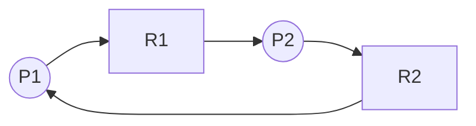

# Chapter 8 — Deadlocks (Operating System Concepts, 10e)

Original, exam-focused notes (not copied). Deadlocks are **very high yield** for long theory + numericals (Banker’s algorithm).

---

## 0) What to prioritize

**Very high yield:**
- deadlock definition and conditions (Coffman conditions)
- resource-allocation graph (RAG) and cycle interpretation
- deadlock handling methods: prevention, avoidance, detection & recovery
- Banker’s algorithm: safety + resource request algorithm (numericals)

---

## 1) What is deadlock?

**Deadlock:** a set of processes are blocked because each holds at least one resource and waits for another held by another process.

---

## 2) Necessary conditions (Coffman) — memorize

1. **Mutual exclusion:** at least one resource is non-shareable.
2. **Hold and wait:** a process holds resources while requesting more.
3. **No preemption:** resources can’t be forcibly taken; must be released voluntarily.
4. **Circular wait:** there exists a cycle of processes waiting on one another.

**Exam trick:** to prevent deadlock, break at least one of these conditions.

---

## 3) Resource-Allocation Graph (RAG)

Nodes:
- processes (circles)
- resources (squares)

Edges:
- request edge: process → resource
- assignment edge: resource → process

**Interpretation:**
- If each resource type has **one instance**, a cycle implies deadlock.
- If resources have **multiple instances**, a cycle indicates possible deadlock (not guaranteed).

---

## 4) Methods to handle deadlocks

### 4.1 Prevention (break a Coffman condition)
- Mutual exclusion: make resources sharable if possible (not always).
- Hold and wait: require process to request all resources at once (inefficient).
- No preemption: allow preemption of resources (not always possible).
- Circular wait: impose ordering on resource acquisition.

### 4.2 Avoidance (Banker’s algorithm)
Only grant a request if system remains in a **safe state**.

### 4.3 Detection and recovery
- allow deadlocks, detect cycles periodically
- recover by terminating processes or preempting resources

---

## 5) Banker’s algorithm (must-master)

### 5.1 Data structures
- `Available[m]`: available instances of each resource type
- `Max[n][m]`: maximum demand of each process
- `Allocation[n][m]`: currently allocated
- `Need[n][m] = Max - Allocation`

### 5.2 Safety algorithm (idea)
A state is **safe** if there exists an order (safe sequence) where each process can finish with available resources plus those released by previously finished processes.

### 5.3 Resource request algorithm
A request by process i, `Request_i`:
1. Check `Request_i <= Need_i`
2. Check `Request_i <= Available`
3. Pretend allocate; run safety test
4. If safe → grant; else → deny and make process wait

---

## 6) Write-up templates

### Template A — “Deadlock conditions + prevention” (10 marks)
- define deadlock
- list 4 conditions
- show how breaking each prevents
- short concluding note on tradeoffs

### Template B — “Banker’s algorithm” (12 marks)
- define safe/unsafe
- list matrices: Available/Max/Allocation/Need
- write safety steps
- solve a small example safe sequence
