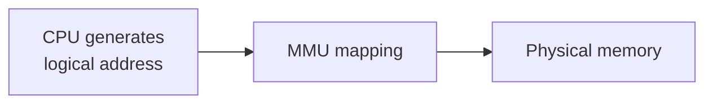
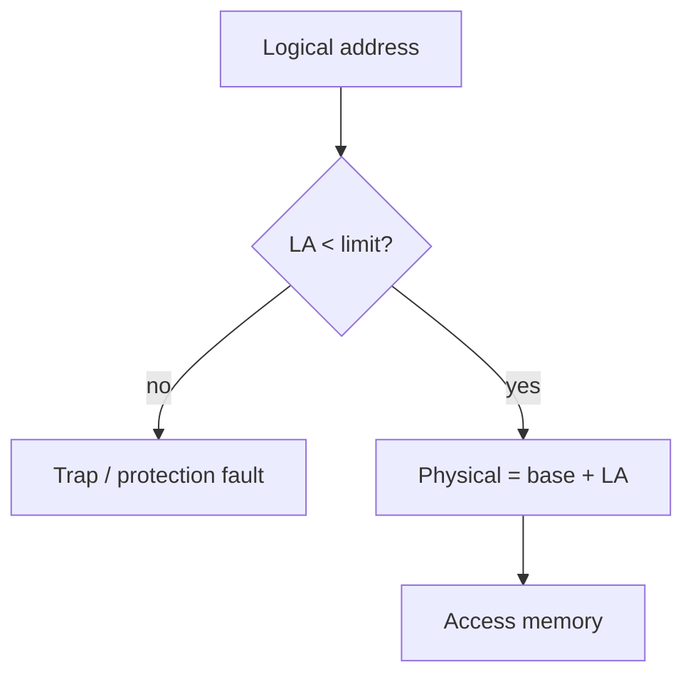
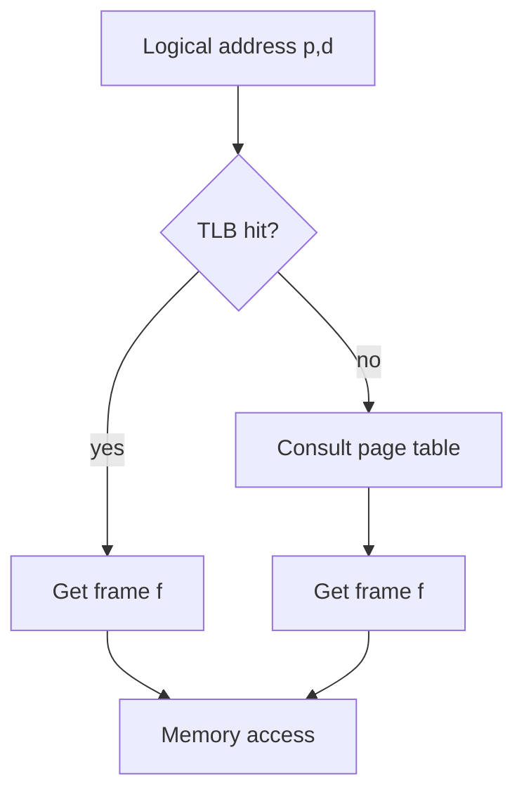

# Chapter 9 — Main Memory (Operating System Concepts, 10e)

Original, exam-focused notes (not copied). This chapter is **high-yield** for both theory and numericals.

---

## 0) What to prioritize (exam map)

**Very high yield:**
- address binding (compile/load/execution time)
- logical vs physical address; MMU
- relocation (base/limit)
- contiguous allocation: fixed/variable partitions, fragmentation
- paging basics: pages/frames, page table, internal fragmentation
- TLB basics + effective access time (EAT) numericals

**Medium yield:**
- segmentation basics
- swapping overview

---

## 1) Basic memory terms

- **Logical (virtual) address:** generated by CPU.
- **Physical address:** seen by memory hardware.
- **MMU (Memory Management Unit):** hardware that maps logical → physical.



---

## 2) Address binding (classic theory)

Binding = mapping program addresses to memory addresses.

- **Compile-time binding:** if load location known at compile time; absolute code.
- **Load-time binding:** final address decided when loaded; relocatable code.
- **Execution-time binding:** can move during execution; needs hardware support (MMU).

---

## 3) Relocation with base/limit registers (very high yield)

- **Base (relocation) register:** smallest physical address of the process.
- **Limit register:** size (or max logical address allowed).

**Hardware check:**
- if `logical < limit` then `physical = base + logical`
- else trap (protection fault)



---

## 4) Contiguous memory allocation

### 4.1 Fixed partitions
- RAM split into fixed-size partitions.
- Internal fragmentation common.

### 4.2 Variable partitions
- partitions sized to process.
- External fragmentation common.

### 4.3 Fragmentation
- **Internal fragmentation:** wasted space *inside* allocated block.
- **External fragmentation:** free space exists but in scattered holes.

**Placement algorithms:**
- First fit, best fit, worst fit (often short theory).

---

## 5) Paging (core concept)

Paging avoids external fragmentation by using fixed-size blocks.

- logical memory split into **pages**
- physical memory split into **frames**
- page table maps page → frame

Address format:
- logical address = (page number `p`, offset `d`)
- physical address = (frame `f`, offset `d`)

```mermaid
flowchart LR
  LA[Logical address
p | d] --> PT[Page Table]
  PT -->|p → f| PA[Physical address
f | d]
```

### Internal fragmentation in paging
If process size isn’t a multiple of page size, the last page is partially filled.

---

## 6) Page table and TLB

### 6.1 Page table
Stored in memory; each access may require extra memory references.

### 6.2 TLB (Translation Lookaside Buffer)
A small, fast cache of recent page→frame translations.

- **TLB hit:** translation found quickly
- **TLB miss:** consult page table in RAM



---

## 7) Effective Access Time (EAT) (must-master numerical)

Let:
- memory access time = $m$
- TLB lookup time = $\varepsilon$
- TLB hit ratio = $h$

Typical model:
- Hit cost = $\varepsilon + m$
- Miss cost = $\varepsilon + 2m$ (page table + actual memory)

So:
$$EAT = h(\varepsilon + m) + (1-h)(\varepsilon + 2m)$$

(If your course ignores $\varepsilon$, you can set it to 0.)

---

## 8) Segmentation (overview)

Segmentation divides logical memory into variable-sized segments (code, data, stack).

Logical address = (segment `s`, offset `d`).
Each segment table entry has:
- base
- limit

Protection: `d < limit` else trap.

---

## 9) Swapping (short overview)

Swapping moves a whole process between RAM and backing store to free memory.
- enables more multiprogramming
- cost is disk I/O overhead

---

## 10) Write-up templates

### Template A — Base/limit protection (8 marks)
- define logical vs physical
- define base+limit
- show check + formula
- explain how it provides relocation + protection

### Template B — Paging + TLB (10 marks)
- define pages/frames
- show address split p|d
- explain page table and TLB hit/miss
- give EAT formula
