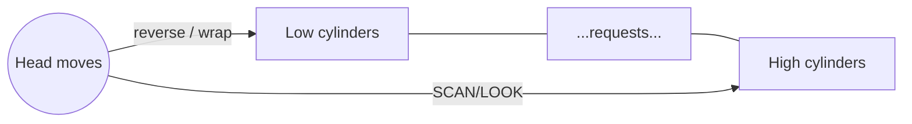

# Chapter 11 — Mass-Storage Structure (Operating System Concepts, 10e)

Original, exam-focused notes (not copied). High-yield because exams often include **disk scheduling numericals**.

---

## Beginner shortcuts (layman + mnemonics)

- In one line: Mass storage is about disks/SSDs, scheduling requests, and reliability.
- Mnemonic: SCAN = elevator goes to end; LOOK = elevator stops at last request; C-SCAN = one direction then wrap.
- Common confusion: total head movement = sum of absolute differences along the path.
- Exam keywords: disk scheduling, RAID idea, latency/throughput.

## 0) What to prioritize

**Very high yield:**
- HDD structure terms (track/sector/cylinder), seek time/rotational latency/transfer time
- disk scheduling algorithms: FCFS, SSTF, SCAN, C-SCAN, LOOK, C-LOOK
- total head movement numericals
- RAID levels (0/1/5/6/10) concepts

**Medium yield:**
- SSD vs HDD differences (short)
- swap space concept

---

## 1) Disk basics (HDD)

Key terms:
- **Track:** concentric circle on platter
- **Sector:** segment of a track
- **Cylinder:** set of tracks at same radius across platters

Performance components:
- **Seek time:** move head to correct track (dominant for HDD)
- **Rotational latency:** wait for sector to rotate under head
- **Transfer time:** time to read/write bits

**Exam line:** Disk I/O time ≈ seek + rotational latency + transfer.

---

## 2) Disk scheduling: why needed?

When multiple requests are pending, OS chooses order to:
- reduce seek movement (improves throughput)
- provide fairness and bounded waiting

---

## 3) Disk scheduling algorithms (must know)

Assume a disk head at position `H` and a request queue of cylinder numbers.

### 3.1 FCFS
Serve requests in arrival order.
- fair, simple
- can be slow (large head movement)

### 3.2 SSTF (Shortest Seek Time First)
Always serve the closest request.
- better average seek
- can starve far requests

### 3.3 SCAN (Elevator)
Head moves in one direction serving requests, then reverses.
- reduces variance

### 3.4 C-SCAN
Head moves in one direction serving requests; at end, jumps to start (circular).
- more uniform wait times

### 3.5 LOOK / C-LOOK
Like SCAN/C-SCAN but only go as far as the last request in that direction (don’t go to physical end unless needed).

---

## 4) Diagram: “elevator” intuition

---

## 5) RAID (very common theory)

Goal: improve **performance**, **reliability**, or both.

High-yield levels:
- **RAID 0 (striping):** fastest, no redundancy (any disk failure loses data).
- **RAID 1 (mirroring):** redundancy by copying; usable capacity ~50%.
- **RAID 5 (striping + distributed parity):** tolerates 1 disk failure.
- **RAID 6 (dual parity):** tolerates 2 disk failures.
- **RAID 10 (1+0):** striped mirrors (good performance + reliability).

---

## 6) SSD vs HDD (short exam notes)

- SSD has no seek/rotation; faster random reads.
- SSD has write endurance concerns; OS may support TRIM.

---

## 7) Write-up templates

### Template A — “Explain disk scheduling” (10 marks)
- define seek/latency/transfer
- why scheduling needed
- explain FCFS, SSTF, SCAN, C-SCAN, LOOK
- mention starvation (SSTF) and fairness (SCAN/C-SCAN)

### Template B — “Explain RAID levels” (8–10 marks)
- define RAID
- compare 0/1/5/6/10 with one-line pros/cons
