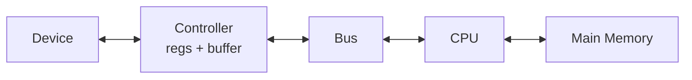
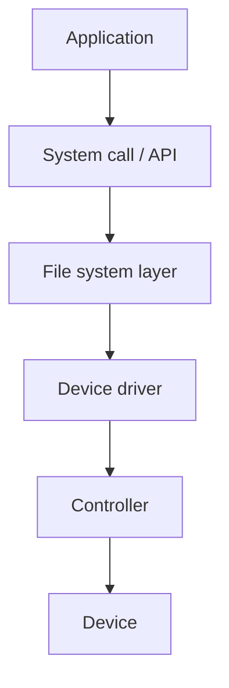

# Chapter 12 — I/O Systems (Operating System Concepts, 10e)

Original, exam-focused notes (not copied). High-yield because exams ask **interrupt vs polling**, **DMA**, buffering/caching/spooling, and I/O software layers.

---

## 0) What to prioritize

**Very high yield:**
- programmed I/O vs interrupt-driven I/O vs DMA
- I/O hardware components: controller, registers, device driver
- interrupt handling path (short)
- kernel I/O subsystem: buffering, caching, spooling
- device drivers and device independence

**Medium yield:**
- blocking vs non-blocking I/O
- synchronous vs asynchronous I/O

---

## 1) I/O hardware basics

- **Device controller:** electronics that control a device.
- **Device registers:** status, control, data registers.
- **Interrupt:** controller notifies CPU.

---

## 2) Three I/O methods (must compare)

### 2.1 Polling (programmed I/O)
CPU repeatedly checks device status.
- simple
- wastes CPU cycles

### 2.2 Interrupt-driven I/O
CPU starts I/O/W, continues other work, and device interrupts on completion.
- better CPU utilization

### 2.3 DMA
DMA controller transfers blocks between device and memory, then interrupts.
- best for large transfers

---

## 3) I/O software stack (exam diagram)

**Device independence:** same `read()` call can work for different devices via drivers.

---

## 4) Kernel I/O subsystem services

### 4.1 Buffering
Store data in memory while transferring.
- handles speed mismatch
- enables block-size adaptation

### 4.2 Caching
Keep frequently used data in memory.
- reduces device accesses

### 4.3 Spooling
Place output in a queue (e.g., print spool) to serialize access to a device.

### 4.4 Error handling
Detect errors and retry/report.

---

## 5) Blocking vs non-blocking I/O

- **Blocking:** call returns after I/O completes.
- **Non-blocking:** returns immediately; program checks later.

---

## 6) Write-up templates

### Template A — “Compare polling, interrupt, DMA” (8–10 marks)
- define each
- CPU overhead comparison
- where each is used

### Template B — “Buffering vs caching vs spooling” (6 marks)
- define each with one example
