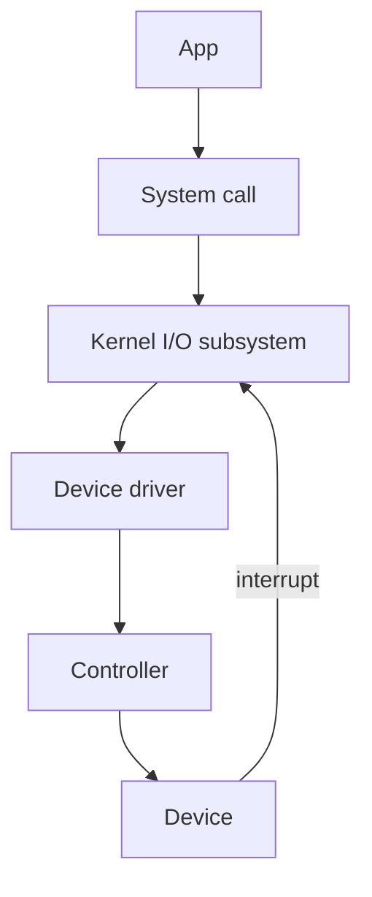

# Chapter 12 — Fully Solved Questions (I/O Systems)

All questions include complete answers/solutions.

---

## A) Short Theory — Solved

### Q1) Differentiate polling and interrupt-driven I/O.
**Answer:**
- **Polling:** CPU repeatedly checks device status; wastes CPU time.
- **Interrupt-driven:** device interrupts CPU on completion; CPU can do other work meanwhile.

### Q2) What is DMA and when is it preferred?
**Answer:** DMA transfers blocks between a device and main memory using a DMA controller, preferred for large data transfers to reduce CPU overhead.

---

## B) Long Theory — Solved

### Q3) Explain the I/O software stack.
**Answer:** Applications invoke system calls (e.g., `read/write`). The OS routes requests through layers such as the file system and device-independent I/O, then device drivers communicate with controller registers/buffers. Hardware performs the I/O and signals completion via interrupt/DMA completion.



---

## C) Algorithms (Pseudocode) — Complete

### Q4) Algorithm: Interrupt-driven read (conceptual)
```text
read_request(buffer, n):
  program_controller_to_read(n)
  block_current_process()

on_device_interrupt():
  copy_data_from_controller_to_buffer()
  mark_request_complete()
  wake_blocked_process()
```

### Q5) Algorithm: DMA block transfer (conceptual)
```text
dma_read(buffer, n):
  setup_DMA(source=device, dest=buffer, count=n)
  start_DMA()
  block_or_continue_other_work()

on_DMA_interrupt():
  verify_status()
  wake_waiter()
```

---

## D) Buffering/Caching/Spooling — Fully Solved

### Q6) Define buffering, caching, and spooling with examples.
**Answer:**
- **Buffering:** temporary memory storage during transfer (e.g., keyboard input buffer).
- **Caching:** keep frequently used data in memory (e.g., disk block cache).
- **Spooling:** queue output for a device that can’t be shared well (e.g., print jobs in print spooler).

### Q7) Why spooling is needed for printers?
**Answer:** Printers are typically single-user devices at a time; spooling lets many processes submit jobs to a disk queue so the printer is fed sequentially without blocking every process directly.

---

## E) Scenario Questions — Fully Solved

### Q8) A system has high CPU usage during I/O-heavy workloads. What change helps and why?
**Answer:** Switching from polling/programmed I/O to interrupt-driven I/O or DMA helps because CPU no longer spins waiting for device completion; it can schedule other processes and only handle interrupts/completion events.

---

## F) Bonus Exam Pack — Fully Solved

### Q9) Differentiate blocking, non-blocking, and asynchronous I/O.
**Answer:**
- **Blocking I/O:** `read()` waits until data is available (caller sleeps).
- **Non-blocking I/O:** `read()` returns immediately; if no data, returns an error/0 and caller can try later.
- **Asynchronous I/O:** request is submitted and completion is delivered later (signal/callback/completion port); caller continues without polling.

---

### Q10) Numerical: CPU overhead of interrupts vs DMA
Assume:
- Transfer size = **1 MiB**
- Interrupt-driven I/O uses **4 KiB per interrupt**
- CPU service time per interrupt = **5 μs**
- DMA uses **1 interrupt per 1 MiB** transfer
- CPU service time for DMA completion interrupt = **20 μs**

Compute CPU time spent handling interrupts for each method.

**Solution:**
- Number of interrupts (interrupt-driven) = $1\text{ MiB}/4\text{ KiB} = 1024\text{ KiB}/4\text{ KiB} = 256$.
- CPU time = $256 \times 5\,\mu s = 1280\,\mu s = 1.28\,ms$.

DMA:
- Interrupts = 1
- CPU time = $1 \times 20\,\mu s = 20\,\mu s = 0.02\,ms$.

**Final:** Interrupt-driven ≈ **1.28 ms CPU**; DMA ≈ **0.02 ms CPU**.

---

### Q11) Explain single vs double buffering (and why double buffering improves throughput)
**Answer:**
- **Single buffering:** device fills one buffer, then process consumes it; device may wait while process consumes.
- **Double buffering:** two buffers alternate so device can fill buffer B while process consumes buffer A (overlap I/O with processing).

**Exam line:** Double buffering increases throughput when I/O time and processing time can overlap.

---

### Q12) Algorithm: generic device-driver request queue (FCFS)
```text
submit_io(req):
  enqueue(device_queue, req)
  if device_idle:
    start_next()

start_next():
  if device_queue empty:
    device_idle = true
    return
  device_idle = false
  r = dequeue(device_queue)
  program_controller(r)

on_io_complete_interrupt():
  finish_current_request()
  start_next()
```

**Why correct:** ensures one in-flight request per device (typical), preserves arrival order.
