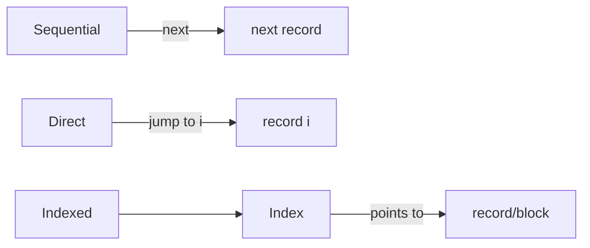

# Chapter 13 — File-System Interface (Operating System Concepts, 10e)

Original, exam-focused notes (not copied). High-yield for theory questions (definitions, comparisons, protection).

---

## Beginner shortcuts (layman + mnemonics)

- In one line: File system interface is what users/programs see: files, directories, and operations.
- Mnemonic: CRUD+O = Create, Read, Update/Write, Delete, Open/Close.
- Common confusion: file descriptor/handle is an OS reference, not the file name.
- Exam keywords: directory structure, access methods, protection bits, mounting.

## 0) What to prioritize

**Very high yield:**
- file concept: attributes, operations
- access methods: sequential vs direct vs indexed
- directory structures (single-level, two-level, tree, acyclic graph)
- file sharing + consistency semantics (short)
- protection: ACLs, permissions, capabilities
- mounting

---

## 1) File concept

**File:** a named collection of related information stored on secondary storage.

### 1.1 Common file attributes
- name
- identifier
- type
- location
- size
- protection
- timestamps + owner

### 1.2 Common file operations
- create
- open / close
- read / write
- seek (reposition)
- delete
- truncate

---

## 2) Access methods (frequently asked compare)

### 2.1 Sequential access
Read/write in order.
- simple, good for logs

### 2.2 Direct (random) access
Access any block/record by number.
- supports databases

### 2.3 Indexed access
Uses an index to map logical record to physical location.
- flexible; index overhead



---

## 3) Directory structure

### 3.1 Single-level directory
- all files in one directory
- name conflicts; no grouping

### 3.2 Two-level directory
- separate directory per user
- better isolation

### 3.3 Tree-structured directory
- hierarchical folders
- common in real OS

### 3.4 Acyclic-graph directory
- supports sharing via links
- must avoid cycles to keep traversal manageable

---

## 4) File sharing and locking (overview)

Sharing issues:
- multiple users/processes accessing same file
- need consistency and/or locks

Locks:
- **shared lock** (readers)
- **exclusive lock** (writer)

---

## 5) Protection and access control (very high yield)

Goal: control who can do what on files.

Common rights:
- read, write, execute
- append
- delete
- list/search

### 5.1 Access Control Lists (ACL)
List of (user/group → permissions).

### 5.2 Capabilities
Tokens/keys that grant rights; possession implies permission.

**Exam compare:**
- ACL: easy to answer “who can access this file?”
- Capabilities: easy to grant delegation but harder to revoke

---

## 6) Mounting

Mounting makes a file system available in the directory tree at a mount point.

```mermaid
flowchart TB
  ROOT[/] --> HOME[/home]
  ROOT --> MNT[/mnt]
  MNT --> FS2[(Mounted FS)]
```

---

## 7) Write-up templates

### Template A — “Access methods” (8 marks)
- define sequential/direct/indexed
- give 1 use case each
- mention tradeoffs

### Template B — “ACL vs capabilities” (8 marks)
- define both
- show one advantage/disadvantage each
