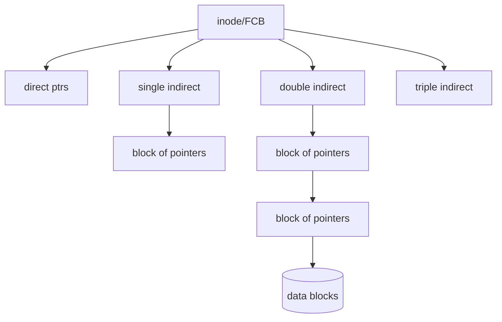
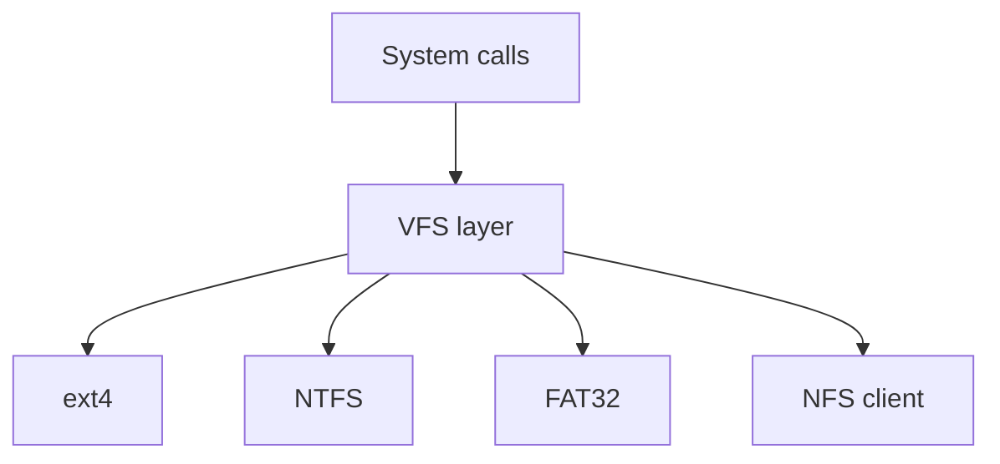

# Chapter 14 — File-System Implementation (Exam Notes)

> Focus: how files/directories are represented on disk, allocation and free-space management, directory implementation, and the interface layer between OS and multiple file systems.

---

## 1) File-system structure (layers)

A practical file system is implemented in **layers** to separate concerns:
- **I/O control**: device drivers + interrupt handlers
- **Basic file system**: block I/O, buffering, caching
- **File-organization module**: manages free space and allocation of blocks
- **Logical file system**: file metadata, directories, protection, naming

```mermaid
flowchart TD
  A[User-level API: open/read/write] --> B[Logical file system<br/>(metadata, directories,<br/>protection)]
  B --> C[File-organization module<br/>allocation, free-space mgmt]
  C --> D[Basic file system<br/>block I/O, buffer cache]
  D --> E[I/O control<br/>drivers, interrupts, DMA]
  E --> F[(Storage device)]
```

**Exam lines:**
- “Logical file system” knows *what* a file is (names, metadata).
- “File-organization module” knows *where* blocks are.

---

## 2) On-disk and in-memory structures

### 2.1 On-disk
Typical on-disk structures:
- **Boot control block** (boot block): code to boot from this volume
- **Volume control block** (superblock): size, block size, free-block count, pointer to free lists/bitmaps
- **Directory structure**: maps names → file control blocks
- **File Control Block (FCB)**: per-file metadata (e.g., inode)

### 2.2 In-memory
To speed operations, OS maintains:
- **Mount table** (mounted FS list)
- **Directory/name cache**
- **System-wide open-file table** (per-file) + **per-process open-file table**

```mermaid
flowchart LR
  P[Process fd table] --> OF[Per-process Open File Entry<br/>(fd -> OFT entry)]
  OF --> S[System-wide Open File Table<br/>file offset, mode, refcount]
  S --> I[In-memory inode/FCB cache<br/>metadata + pointers]
  I --> D[(Disk blocks)]
```

**Why two open-file tables?**
- Multiple processes can share the same open file entry or the same inode.

---

## 3) Directory implementation

### 3.1 Linear list (simple)
Directory is a list of `(name, inode#)` entries.
- Pros: simple, compact
- Cons: lookup is $O(n)$

### 3.2 Hash table (faster)
- Adds a hash from name → directory entry.
- Pros: average $O(1)$ lookup
- Cons: collisions; more space/complexity.

---

## 4) Allocation methods (very exam-heavy)

Let a file consist of data blocks on disk.

### 4.1 Contiguous allocation
File occupies a set of consecutive blocks.
- Directory stores: **start block + length**
- Pros: fast sequential + fast random access
- Cons: **external fragmentation**, growth problem

### 4.2 Linked allocation
File is a linked list of blocks.
- Directory stores: **first block (and maybe last)**
- Pros: no external fragmentation; easy growth
- Cons: poor random access; pointer overhead; reliability issues

**FAT** is a common variant: pointers stored in a table (FAT) in memory.

### 4.3 Indexed allocation
Each file has an index block containing pointers to its data blocks.
- Directory stores: pointer to index block
- Pros: supports direct access; no external fragmentation
- Cons: index overhead, especially for small files

**UNIX inode** is a classic indexed scheme with multi-level indirection.



---

## 5) Free-space management

Goal: track which disk blocks are free.

### 5.1 Bit vector (bitmap)
- One bit per block: `1`=free (or allocated; depends on convention)
- Pros: fast to find runs of free blocks
- Cons: bitmap itself consumes space

### 5.2 Linked list of free blocks
- Each free block points to next free block.
- Pros: no extra structure beyond blocks
- Cons: slow to find contiguous space; traversal cost

### 5.3 Grouping
- First free block contains addresses of many free blocks.

### 5.4 Counting
- Store `(start, count)` extents of contiguous free blocks.

---

## 6) VFS (Virtual File System) idea

VFS provides a **common interface** (`open`, `read`, `write`, …) while allowing multiple file system implementations.



**Exam phrasing:** VFS uses **vnode/inode** abstraction + operation vector (function pointers) per FS.

---

## 7) Quick comparison table (write these in exams)

| Method | Dir stores | Random access | Fragmentation | Growth | Overhead |
|---|---|---|---|---|---|
| Contiguous | start + length | Excellent | External | Hard | Low |
| Linked | first (last) | Poor | None | Easy | Pointer per block |
| Indexed | index block ptr | Good | None | Easy | Index blocks |

---

## 8) Mini templates (exam answers)

- **“Explain FAT”**: linked allocation with pointers stored in FAT; FAT cached in memory; directory entry gives first block; follow FAT chain.
- **“Explain inode”**: file control block storing metadata + block pointers; supports direct + multi-level indirect pointers.
