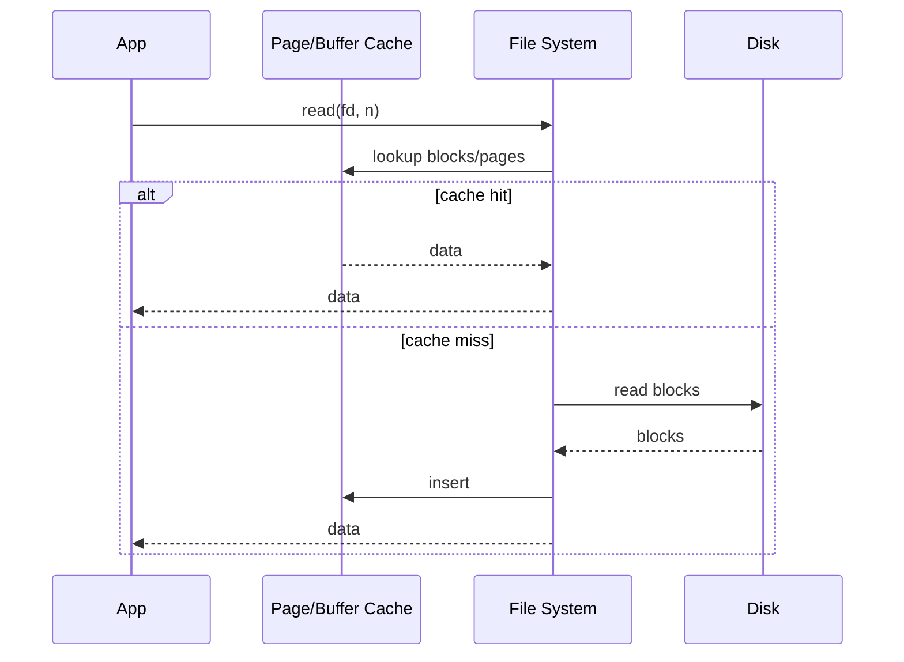
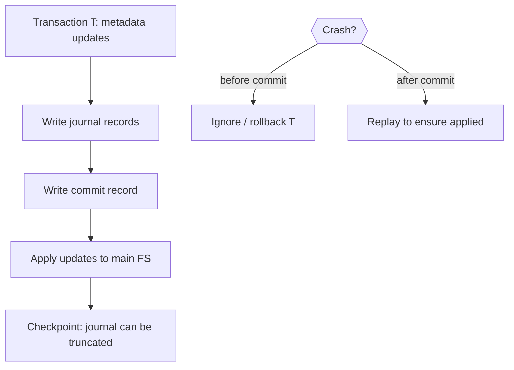

# Chapter 15 — File-System Internals (Exam Notes)

> Focus: making file systems fast and reliable: caching, buffering, recovery, journaling, consistency, and performance techniques.

---

## 1) What “internals” means
File systems must handle:
- **Performance**: caching, buffering, read-ahead, write-behind
- **Reliability**: consistency after crashes, recovery, journaling
- **Implementation tradeoffs**: metadata layout, log-structured designs

---

## 2) Caching and buffering (high-yield)

### 2.1 Buffer cache vs page cache
- **Buffer cache**: caches *disk blocks* for file system (metadata + data)
- **Page cache**: caches *virtual memory pages* of file data

Modern OSs often use a **unified buffer/page cache**.

### 2.2 Why caching matters
Disk I/O is slow; cache turns many reads into memory hits.

### 2.3 Read-ahead and write-behind
- **Read-ahead**: prefetch next blocks for sequential reads
- **Write-behind (delayed write)**: buffer writes and flush later (careful: needs recovery strategy)

---

## 3) Consistency and crash recovery

### 3.1 What can go wrong on crash?
- Metadata partially updated (e.g., inode updated but bitmap not updated)
- Directory entry created but inode not written
- Free-space map inconsistent

### 3.2 Consistency checker (fsck-like idea)
On reboot, scan metadata structures and repair:
- Orphaned inodes
- Wrong link counts
- Bitmap mismatches

**Downside:** can be slow on large disks.

---

## 4) Journaling (log-based recovery)

### 4.1 Basic idea
Before applying changes to the main file system, record an **intent log (journal)**.
After crash, replay journal to reach consistent state.

### 4.2 Modes (common exam phrasing)
- **Metadata journaling**: only metadata logged (fast, common)
- **Full data journaling**: data + metadata logged (safer, slower)
- **Ordered mode**: data written before metadata commit (common compromise)

---

## 5) Log-structured file systems (LFS)

Idea: write everything sequentially in a log to convert random writes into sequential writes.
- Pros: fast writes on rotating disks
- Cons: cleaning/garbage collection overhead; fragmentation

---

## 6) Performance topics to mention in exams

- **Free-space locality**: allocate nearby blocks to reduce seek
- **Extent-based allocation** (store (start, length) extents) improves sequential IO
- **Directory/name caching** reduces path traversal cost
- **Writeback policies**: `fsync()` forces durability of buffered writes

---

## 7) Very common short answers

- **Why delayed write is risky?** Crash may lose buffered updates → need journaling or explicit flush.
- **What is `fsync()`?** Forces cached file data + metadata needed to access it to stable storage.
