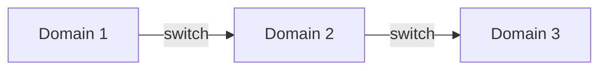
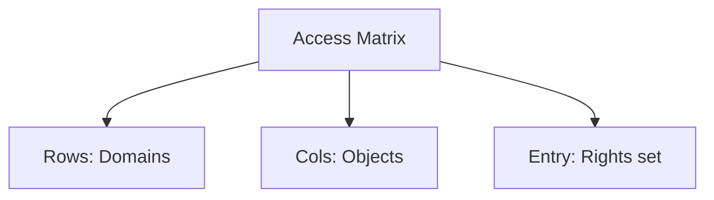

# Chapter 17 — Protection (Exam Notes)

> Focus: controlling access to resources inside OS via domains, access rights, and formal protection models.

---

## Beginner shortcuts (layman + mnemonics)

- In one line: Protection controls what a process/user is allowed to do inside a system.
- Mnemonic: ACM = Access Control Matrix (Subject x Object -> Rights).
- Common confusion: Security is defending from outside threats; Protection is controlling inside access.
- Exam keywords: domains, access rights, ACL vs capabilities.

## 1) Protection vs security
- **Protection**: internal control of access to resources (files, memory, devices, CPU) by processes/users.
- **Security**: broader — includes protection plus external threats (malware, network attacks, etc.).

---

## 2) Domain of protection
A **domain** is a set of `(object, rights)` pairs.
- Rights: read, write, execute, append, delete, etc.

Domain can be:
- User-based (each user is a domain)
- Process-based (each process is a domain)
- Procedure-based (fine-grained)

**Domain switching** must itself be controlled (rights to switch).

---

## 3) Access matrix model (high-yield)

Matrix rows = **domains**, columns = **objects**.
Entry $A[D_i, O_j]$ = set of rights.

### Implementations
- **ACLs** (Access Control Lists): per object → list of (subject/domain, rights)
- **Capability lists**: per subject/domain → list of (object, rights)

---

## 4) Revocation (exam question)
Revoking rights is easier with ACLs (edit one object’s ACL) and harder with capabilities unless you add mechanisms:
- Indirection (capability points to a table entry)
- Version numbers
- Time-limited capabilities

---

## 5) Access control in practice (Unix-style quick)
- Owner, group, others bits (`rwx`)
- Setuid/setgid bits can change effective privilege (security sensitive)

---

## 6) Principle of least privilege (again)
Minimize rights in a domain; reduce blast radius.

---

## 7) Common exam templates

- **“Define access matrix and how implemented”**: abstract model; realized as ACLs or capabilities.
- **“ACL vs capabilities”**: object-centric vs subject-centric; revocation easier in ACL; delegation often easier with capabilities.
