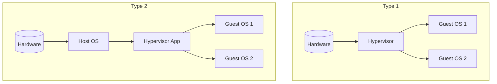

# Chapter 18 — Virtual Machines (Exam Notes)

> Focus: virtualization concepts, hypervisors, CPU/memory/I/O virtualization, and benefits/costs.

---

## 1) What is virtualization?
Virtualization provides an abstraction of hardware so multiple **isolated** environments can run on the same physical machine.

### Benefits
- Consolidation (better utilization)
- Isolation/sandboxing
- Portability (VM images)
- Testing, snapshots, rollback

### Costs
- Overhead (CPU traps, I/O virtualization)
- Complexity (hypervisor, drivers)

---

## 2) VM architecture

### Type 1 (bare-metal) vs Type 2 (hosted)
- **Type 1**: hypervisor runs on hardware (common in servers)
- **Type 2**: hypervisor runs as an app on host OS (common in desktops)

---

## 3) CPU virtualization

### Sensitive vs privileged instructions
Classical issue: some instructions behave differently depending on privilege.

Solutions:
- **Trap-and-emulate**: run guest in lower privilege; trap privileged ops; emulate.
- **Binary translation** (older approach)
- **Hardware virtualization support** (modern): VT-x/AMD-V style modes.

---

## 4) Memory virtualization

Goal: guest thinks it has “physical memory”, but that’s virtualized.

Concepts:
- Guest virtual address (GVA)
- Guest physical address (GPA)
- Host physical address (HPA)

Common mechanisms:
- **Shadow page tables** (hypervisor maintains mappings)
- **Nested paging / EPT** (hardware helps map GPA→HPA)

---

## 5) I/O virtualization

Techniques:
- **Emulation**: hypervisor emulates device (compatible, slower)
- **Paravirtual drivers**: guest uses special high-performance drivers
- **Direct assignment (passthrough)**: device assigned to VM (fast, less flexible)

---

## 6) Isolation and VM security
VMs isolate failures and attacks, but hypervisor becomes high-value target (TCB). Keep hypervisor small and patched.

---

## 7) Exam templates

- **“Type 1 vs Type 2”**: Type 1 on bare metal (better performance/isolation); Type 2 hosted (easier to install, more overhead).
- **“Shadow vs EPT”**: shadow done in software; EPT supported by hardware, typically faster.
