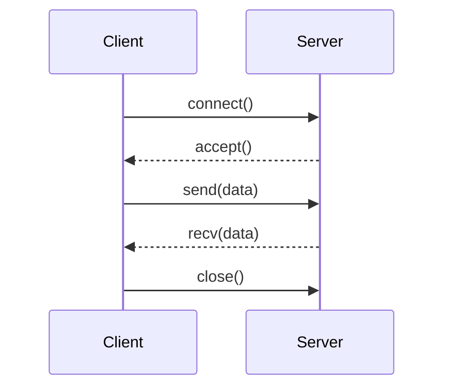

# Chapter 19 — Networks & Distributed Systems (Exam Notes)

> Focus: OS support for networking, distributed computation, naming, RPC, sockets, distributed file systems, and classic distributed issues.

---

## 1) Why OS cares about networking
- Network is an I/O device + communication channel
- OS provides: sockets, protocol stacks, buffering, concurrency, security

---

## 2) Common network concepts (must know)

### Latency vs bandwidth
- **Latency**: time to start getting data
- **Bandwidth**: rate of transfer

### Client-server vs peer-to-peer
- Client-server: centralized service
- P2P: distributed peers

---

## 3) Sockets (exam core)
Socket = endpoint of communication.
- Address = (IP, port)
- Types: stream (TCP), datagram (UDP)

---

## 4) RPC (Remote Procedure Call)
Goal: call a remote function like local call.
- Client stub marshals args → sends message
- Server stub unmarshals → calls server procedure

Key issues:
- Parameter marshalling
- Failure handling
- “At most once” vs “at least once” semantics

---

## 5) Distributed systems challenges

### 5.1 Partial failure
Some nodes fail while others run.

### 5.2 Time and ordering
- Clock drift; no global perfect time
- Logical clocks (Lamport) capture happens-before

### 5.3 Naming and directory services
Need a mapping: name → resource location.

---

## 6) Distributed file systems (DFS)

Goals:
- Transparency (access/location)
- Consistency and caching
- Fault tolerance

Concepts:
- Client-side caching
- Stateless vs stateful servers

---

## 7) Exam templates

- **TCP vs UDP**: TCP reliable ordered stream; UDP unreliable datagrams but lower overhead.
- **RPC problems**: failures, retries, duplicate suppression, idempotency.
- **DFS caching**: improves speed, complicates consistency.
