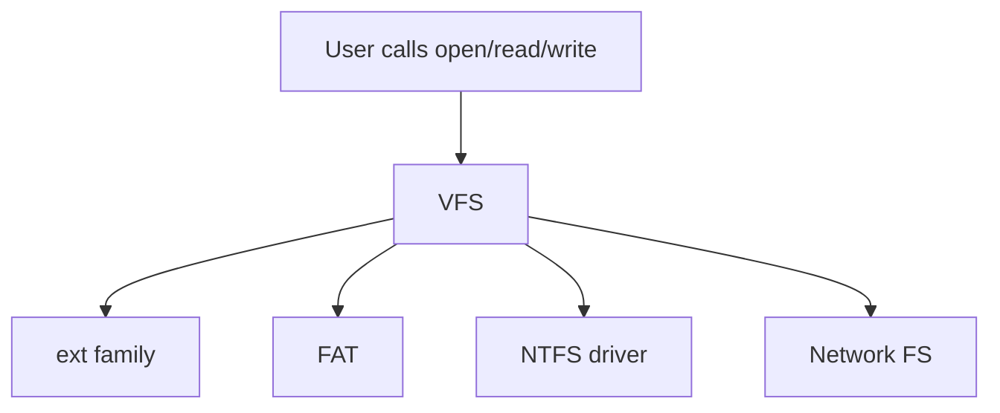

# Chapter 20 — The Linux System (Case Study Notes)

> Exam focus: architecture, processes, scheduling basics, memory, file system view, and key APIs/tools.

---

## 1) Big picture architecture
Linux is a **monolithic kernel** with loadable modules.

```mermaid
flowchart TD
  U[User Space<br/>(apps, shells, daemons)] --> S[System Call Interface]
  S --> K[Linux Kernel<br/>(process, memory, VFS,<br/>networking, drivers)]
  K --> HW[(Hardware)]
```

### Kernel-space vs user-space
- User programs run with restricted privileges.
- Kernel runs with full privileges and exposes services via **system calls**.

---

## 2) Processes and threads in Linux

### Task model
Linux historically used a unified concept: **task**.
- A “process” and “thread” are both tasks; threads share resources.

### Creating processes/threads (exam lines)
- `fork()` creates a new process (child) largely as a copy.
- `exec()` replaces the process image with a new program.
- Threads can be created via APIs (e.g., `pthread_create`) and rely on kernel primitives.

**Copy-on-write** makes `fork()` efficient.

---

## 3) Scheduling overview (case-study level)

Key ideas to state in exams:
- Linux uses preemptive scheduling.
- Modern Linux scheduling aims for fairness + interactivity.

(Exact scheduler internals vary by version; exam answers should focus on concepts: time-slicing, priorities, fairness, preemption.)

---

## 4) Memory management overview

Concepts to mention:
- Virtual memory with paging
- Demand paging and page cache
- Shared libraries
- Copy-on-write

---

## 5) VFS and file systems

Linux provides a **Virtual File System (VFS)** layer:
- Common interface: `open`, `read`, `write`, `close`, etc.
- Supports many file systems via a uniform abstraction.



---

## 6) Modules and device drivers
- Many drivers can be loaded/unloaded as **kernel modules**.
- Benefits: smaller base kernel, flexible hardware support.

---

## 7) Security/protection quick points
- User/group permissions + modes
- Capabilities (fine-grained privileges)
- Mandatory access control frameworks may be used in deployments

---

## 8) Exam templates

- **“Why COW makes fork fast?”**: pages are shared read-only; copies made only on write.
- **“What is VFS?”**: uniform file API across many file systems.
- **“Monolithic vs microkernel?”**: Linux is monolithic (performance, integrated services) but supports modular drivers.
