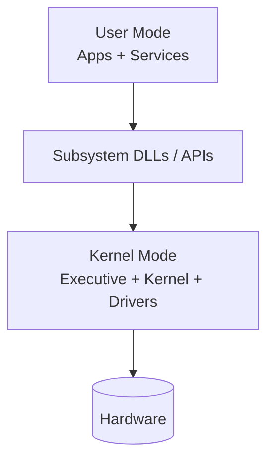
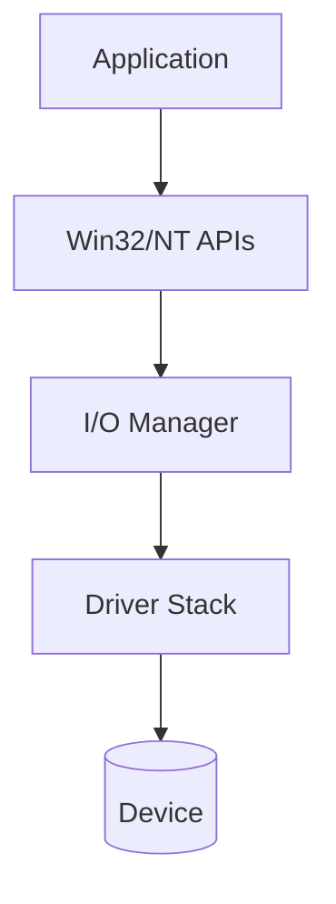

# Chapter 21 — Windows 10 (Case Study Notes)

> Exam focus: high-level architecture, process/thread model, memory manager concepts, I/O model, and security basics.

---

## 1) Architecture overview
Windows follows a **hybrid kernel** approach (mix of monolithic performance and modular layering).

Key exam phrasing:
- Clear separation of **user mode** and **kernel mode**
- Many OS services provided by kernel-mode components and drivers

---

## 2) Process and thread model

- **Process**: container for address space + resources (handles)
- **Thread**: unit of CPU execution; scheduled entity

Windows is **thread-centric** for scheduling: threads are scheduled, processes provide the environment.

---

## 3) Scheduling overview (exam-level)

Concepts:
- Preemptive, priority-based scheduling
- Dynamic adjustments to favor responsiveness

(Exact tuning varies across versions; in exams focus on priorities, preemption, quantum/time-slice.)

---

## 4) Memory management overview

Concepts to mention:
- Virtual memory and paging
- Working set concept (set of pages a process keeps resident)
- Pagefile-backed pages
- Memory-mapped files

---

## 5) I/O model overview

Windows uses layered I/O with drivers; I/O requests flow through driver stacks.

Common exam points:
- Asynchronous I/O is widely supported
- Caching can occur in system cache

---

## 6) Security quick points

- Security identifiers (users/groups) and access checks
- Access control using ACLs
- Privilege separation (user vs admin), tokens

---

## 7) Exam templates

- **“Process vs thread in Windows”**: process = resources + address space; thread = execution.
- **“Why thread-centric scheduling?”**: scheduling chooses threads; processes just group threads/resources.
- **“Windows I/O path”**: app → I/O manager → drivers → device.
