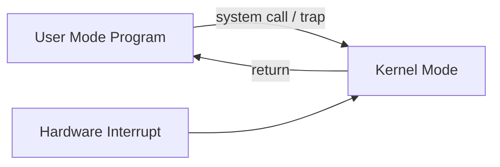
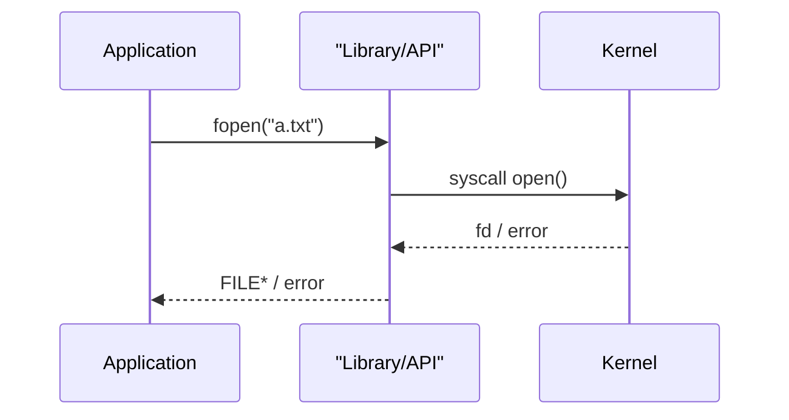
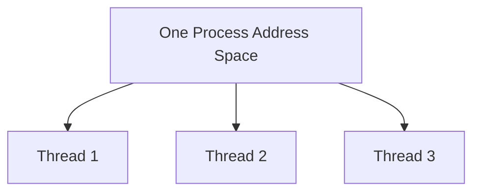
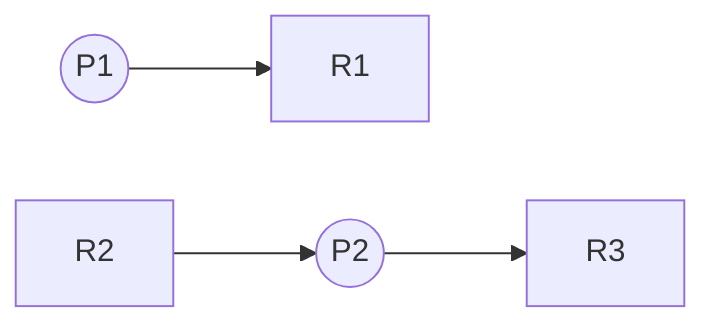
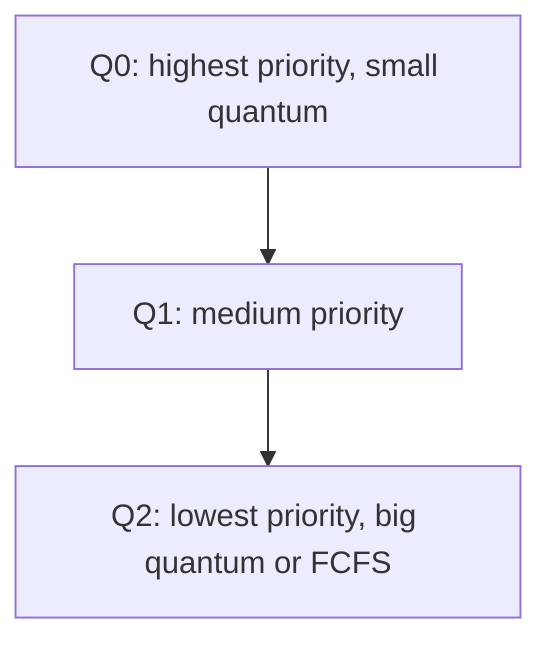
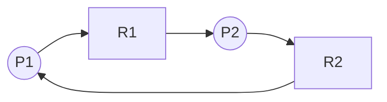

# Important Topics (OS Theory) - 100 Marks Syllabus Pack

This file is a **beginner-friendly, exam-focused** guide to the exact topics your teacher listed.

How to study this file:
- Read the **concept** section first.
- Then memorize the **exam points**.
- Then practice the **solved numericals** (repeat until you can reproduce the steps).

Quick navigation (use Ctrl+F):
- 4) Banker's Algorithm + RAG
- 5) Semaphores (pseudocode)
- 6) MLFQ scheduling
- 7) Paging vs Segmentation
- 10) First/Best/Worst fit
- 11) FIFO/LRU/OPT
- 12) Disk scheduling
- 13) Virtual memory (EAT)
- 16) Enhanced practice pack (extra solved numericals)

---

## Marks map (as per your list)

### Short questions (theory)
- Kernel
- System call
- Multiprocessing
- Multithreading
- (And the minimum extra basics needed to understand them)

### Numericals / algorithms
1. Deadlock avoidance (Banker's Algorithm) + Resource Allocation Graph (RAG)
2. Semaphores: write pseudocode for each process
3. CPU Scheduling: Multi-Level Feedback Queue (MLFQ) only

### Long questions (theory)
- Segmentation and paging: define + explain
- Page tables: Simple vs Inverted vs Hashed (memory usage + processing overhead)
- Dynamic linking/loading vs Static linking/loading

### Long numericals
1. First Fit, Best Fit, Worst Fit (contiguous memory allocation)
2. Paging replacement: FIFO, LRU, OPT (OPR)
3. Disk scheduling: FCFS, SCAN, C-SCAN, LOOK
4. One numerical from Virtual Memory

---

## 0) Quick prerequisites (very small but necessary)

### 0.1 Program vs process vs thread (minimum)
- **Program**: a file on disk (set of instructions).
- **Process**: a running instance of a program (has its own address space, resources).
- **Thread**: an execution path inside a process (shares process memory, has its own stack/registers).

### 0.2 CPU burst vs I/O burst
A typical process alternates:
- **CPU burst**: uses CPU to compute
- **I/O burst**: waits for disk/keyboard/network

This is why scheduling matters.

---

## 1) Kernel (short question + diagram)

### 1.1 What is a kernel?
The **kernel** is the core part of the operating system that runs in **privileged mode** and:
- controls hardware safely
- manages CPU, memory, and I/O devices
- provides services to programs (via system calls)

**One-line answer (exam):** Kernel is the privileged core of the OS that manages resources and provides system-call services.

### 1.2 User mode vs kernel mode (why it exists)
- In **user mode**, programs cannot execute dangerous instructions.
- In **kernel mode**, the OS can execute privileged instructions (I/O, memory management).



### 1.3 What the kernel manages (short bullet list)
- **Process management**: create/terminate processes, context switch
- **CPU scheduling**: decide which process/thread runs next
- **Memory management**: allocate RAM, virtual memory, paging
- **File systems**: manage files and directories
- **Device management**: drivers, buffering, interrupts
- **Security/protection**: access control, isolation

### 1.4 Kernel types (very short, only what helps)
| Type | Key idea | Exam point |
|---|---|---|
| Monolithic | Most services in kernel | Fast, large trusted code |
| Microkernel | Minimal kernel; services in user space | Safer isolation, IPC overhead |
| Hybrid | Mix of both | Used by Windows-like designs |

---

## 2) System Calls (short question + diagram + tiny example)

### 2.1 What is a system call?
A **system call** is a controlled entry into the kernel so a user program can request an OS service.

Examples:
- file: open, read, write
- process: fork, exec, wait
- memory: allocate pages, map memory

### 2.2 Why system calls exist
- **Protection**: user code cannot directly access hardware
- **Correctness**: kernel validates parameters
- **Convenience**: standard API for all programs

### 2.3 API vs System call
- **API** (like a library function) may call **one or more** system calls.



### 2.4 What happens during a system call (step-by-step)
1. Program places syscall number + arguments
2. Program executes a trap instruction
3. CPU switches to kernel mode and jumps to syscall handler
4. Kernel validates arguments and permissions
5. Kernel performs service and returns a result
6. CPU returns to user mode

**Mini pseudocode (exam-friendly):**
```text
user:
  set args
  trap
kernel:
  validate
  do service
  return
```

---

## 3) Multiprocessing vs Multithreading (short questions)

### 3.1 Multiprocessing
**Meaning:** system has **multiple CPUs/cores**; OS can run multiple processes at the same time.

Benefits:
- higher throughput
- better responsiveness
- better reliability (a core failure does not always kill system)

### 3.2 Multithreading
**Meaning:** a process has **multiple threads**.

Benefits:
- responsiveness (UI + background work)
- cheap context switching compared to processes
- easy sharing of data (shared address space)

### 3.3 Multiprogramming vs Multiprocessing (common confusion)
| Term | Meaning |
|---|---|
| Multiprogramming | many processes in memory; CPU switches when one blocks |
| Multiprocessing | multiple CPUs/cores execute simultaneously |

### 3.4 Process vs thread (classic table)
| Feature | Process | Thread |
|---|---|---|
| Address space | separate | shared (inside process) |
| Creation cost | higher | lower |
| Communication | IPC needed | shared memory (needs sync) |
| Failure isolation | better | one bad thread can crash process |



---

## 4) Deadlock avoidance: Banker's Algorithm + Resource Allocation Graph (Numerical)

### 4.1 Deadlock basics (needed for Banker's)
**Deadlock:** a set of processes are stuck forever because each is waiting for resources held by another.

Four necessary conditions (memorize):
1. Mutual exclusion
2. Hold and wait
3. No preemption
4. Circular wait

### 4.2 Banker's Algorithm (what it answers)
Banker's checks: **If we grant this request now, will the system remain in a safe state?**

- **Safe state**: there exists a sequence of process completion (safe sequence) such that each process can finish with currently available + released resources.

### 4.3 Data structures (must know)
Assume:
- n processes, m resource types

Tables:
- **Available[m]**: currently available instances of each resource type
- **Max[n][m]**: maximum demand of each process
- **Allocation[n][m]**: currently allocated
- **Need[n][m] = Max - Allocation**

### 4.4 Safety algorithm (step-by-step)
1. Set `Work = Available`
2. Set `Finish[i] = false` for all processes
3. Find a process i such that `Finish[i] = false` and `Need[i] <= Work`
4. If found:
   - `Work = Work + Allocation[i]`
   - `Finish[i] = true`
   - add i to safe sequence
5. Repeat until no more can be found
6. If all `Finish[i] = true` then system is safe

### 4.5 Solved numerical (Banker's)

**Given (3 resource types A, B, C and 5 processes P0..P4):**

Available:
- A=3, B=3, C=2

Allocation:
| Process | A | B | C |
|---|---:|---:|---:|
| P0 | 0 | 1 | 0 |
| P1 | 2 | 0 | 0 |
| P2 | 3 | 0 | 2 |
| P3 | 2 | 1 | 1 |
| P4 | 0 | 0 | 2 |

Max:
| Process | A | B | C |
|---|---:|---:|---:|
| P0 | 7 | 5 | 3 |
| P1 | 3 | 2 | 2 |
| P2 | 9 | 0 | 2 |
| P3 | 2 | 2 | 2 |
| P4 | 4 | 3 | 3 |

**Step 1: compute Need = Max - Allocation**
| Process | Need A | Need B | Need C |
|---|---:|---:|---:|
| P0 | 7 | 4 | 3 |
| P1 | 1 | 2 | 2 |
| P2 | 6 | 0 | 0 |
| P3 | 0 | 1 | 1 |
| P4 | 4 | 3 | 1 |

**Step 2: Safety check**
- Work = (3, 3, 2)

Find a process with Need <= Work:
- P1 Need (1,2,2) <= (3,3,2) yes
  - Work = Work + Allocation(P1) = (3,3,2) + (2,0,0) = (5,3,2)
  - Sequence: P1

Next:
- P3 Need (0,1,1) <= (5,3,2) yes
  - Work = (5,3,2) + Allocation(P3)(2,1,1) = (7,4,3)
  - Sequence: P1, P3

Next:
- P4 Need (4,3,1) <= (7,4,3) yes
  - Work = (7,4,3) + Allocation(P4)(0,0,2) = (7,4,5)
  - Sequence: P1, P3, P4

Next:
- P0 Need (7,4,3) <= (7,4,5) yes
  - Work = (7,4,5) + Allocation(P0)(0,1,0) = (7,5,5)
  - Sequence: P1, P3, P4, P0

Next:
- P2 Need (6,0,0) <= (7,5,5) yes
  - Work = (7,5,5) + Allocation(P2)(3,0,2) = (10,5,7)
  - Sequence: P1, P3, P4, P0, P2

Result: **Safe state**. One safe sequence is:
- **P1 -> P3 -> P4 -> P0 -> P2**

### 4.6 Resource Allocation Graph (RAG)
RAG is a graph to visualize allocation/request.

- Process node: circle (P1)
- Resource node: square (R1)
- Request edge: P -> R
- Assignment edge: R -> P



**Exam facts (very important):**
- If each resource type has **only one instance**, a cycle implies deadlock.
- With **multiple instances**, cycle is necessary but not sufficient.

### 4.7 "Banker's with request" mini-template
If a process Pi requests `Request[i]`:
1. Check `Request[i] <= Need[i]` (else error)
2. Check `Request[i] <= Available` (else wait)
3. Pretend allocate:
   - Available -= Request
   - Allocation += Request
   - Need -= Request
4. Run safety algorithm. If safe, grant; else rollback.

---

## 5) Semaphores (Numerical/algorithm + pseudocode)

### 5.1 Why we need synchronization
Threads share memory. Without control, you can get:
- race conditions
- wrong output
- corrupted data

### 5.2 Semaphore definition
A **semaphore** is an integer variable used to control access to shared resources, using two atomic operations:
- `wait(S)` (also called P/down)
- `signal(S)` (also called V/up)

### 5.3 Wait and signal (standard pseudocode)
```text
wait(S):
  S = S - 1
  if S < 0:
    block this process

signal(S):
  S = S + 1
  if S <= 0:
    wake one blocked process
```

### 5.4 Types
| Type | Values | Use |
|---|---|---|
| Binary semaphore (mutex) | 0/1 | mutual exclusion |
| Counting semaphore | 0..k | k identical resources |

### 5.5 Solved: Critical section with mutex
Goal: Only one process enters critical section at a time.

Initialize:
- `mutex = 1`

Process Pi:
```text
wait(mutex)
  // critical section
signal(mutex)
  // remainder section
```

### 5.6 Solved: Producer-Consumer (bounded buffer) with semaphores
We need three semaphores:
- `mutex = 1` (protect buffer)
- `empty = N` (empty slots)
- `full = 0` (filled slots)

**Producer:**
```text
while true:
  item = produce()
  wait(empty)
  wait(mutex)
    insert(item)
  signal(mutex)
  signal(full)
```

**Consumer:**
```text
while true:
  wait(full)
  wait(mutex)
    item = remove()
  signal(mutex)
  signal(empty)
  consume(item)
```

**What to write in exam:**
- define the three semaphores
- show correct wait/signal order
- explain that `mutex` prevents race, `empty/full` enforce buffer bounds

### 5.7 Solved: Readers-Writers (basic)
Goal: many readers can read together; writers need exclusive access.

Semaphores:
- `rw_mutex = 1` (lock for writers or first reader)
- `mutex = 1` (protect read_count)
- `read_count = 0`

Reader:
```text
wait(mutex)
  read_count = read_count + 1
  if read_count == 1:
    wait(rw_mutex)
signal(mutex)

// reading

wait(mutex)
  read_count = read_count - 1
  if read_count == 0:
    signal(rw_mutex)
signal(mutex)
```

Writer:
```text
wait(rw_mutex)
  // writing
signal(rw_mutex)
```

---

## 6) CPU Scheduling: Multi-Level Feedback Queue (MLFQ) only

### 6.1 Why MLFQ exists
We want both:
- good response for interactive (short CPU bursts)
- good throughput for CPU-bound jobs

MLFQ tries to approximate SJF without knowing burst times in advance.

### 6.2 Core idea
- Multiple ready queues with different priorities.
- Higher priority queues use small time quantum.
- If a process uses its whole quantum, it is moved down.
- If it yields early (I/O-bound), it may stay high.



### 6.3 Typical rules (write these in exam)
- Always run from the highest non-empty queue.
- Within a queue, use RR (usually).
- Demote if full quantum used.
- Periodic priority boost to prevent starvation.

### 6.4 Solved example (MLFQ scheduling)

Assume:
- Q0 quantum = 2
- Q1 quantum = 4
- Q2 = FCFS (or very large quantum)
- All arrive at time 0

Processes:
| Process | Burst time |
|---|---:|
| P1 | 5 |
| P2 | 3 |
| P3 | 8 |

**Step-by-step timeline (one common rule-set):**

Start all in Q0.

1) Q0 RR (q=2)
- P1 runs 2 (remaining 3) uses full q -> demote to Q1
- P2 runs 2 (remaining 1) uses full q -> demote to Q1
- P3 runs 2 (remaining 6) uses full q -> demote to Q1

2) Q1 RR (q=4)
- P1 runs 3 (finishes) because it needs only 3 (<4)
- P2 runs 1 (finishes)
- P3 runs 4 (remaining 2) uses full q -> demote to Q2

3) Q2 FCFS
- P3 runs remaining 2 and finishes

**Gantt chart (time):**
- 0-2 P1 | 2-4 P2 | 4-6 P3 | 6-9 P1 | 9-10 P2 | 10-14 P3 | 14-16 P3

Now compute:
- Completion times: P1=9, P2=10, P3=16
- Turnaround time (AT=0): TAT = CT
- Waiting time: WT = TAT - BT

| Process | BT | CT | TAT | WT |
|---|---:|---:|---:|---:|
| P1 | 5 | 9 | 9 | 4 |
| P2 | 3 | 10 | 10 | 7 |
| P3 | 8 | 16 | 16 | 8 |

**Important note:** Exact numbers depend on the exact MLFQ rule-set (boosting, I/O behavior). In exams, always write the rule-set before solving.

### 6.5 Common exam questions (short)
1. Why MLFQ prevents starvation? (Answer: periodic boost)
2. Why MLFQ favors interactive jobs? (Answer: I/O-bound yields early, stays higher priority)

---

## 7) Segmentation and Paging (long question)

### 7.1 The problem both solve
Programs use addresses like 0..(size-1). OS must place them in physical memory safely and efficiently.

### 7.2 Paging (definition + working)
**Paging** splits:
- logical memory into fixed-size **pages**
- physical memory into fixed-size **frames**

Address = (page number p, offset d)

```mermaid
flowchart LR
  LA[Logical address: p | d] --> PT[Page Table]
  PT --> PA[Physical address: f | d]
```

Pros:
- no external fragmentation
- easy swapping

Cons:
- page table memory overhead
- internal fragmentation (last page partly used)

### 7.3 Segmentation (definition + working)
**Segmentation** divides program into logical parts (segments):
- code
- data
- stack
- heap

Address = (segment number s, offset d)

Segment table stores:
- base (starting physical address)
- limit (segment size)

```mermaid
flowchart LR
  LA[Logical address: s | d] --> ST[Segment Table]
  ST --> PA[Physical address: base + d]
```

Pros:
- matches programmer's view
- supports protection/sharing per segment

Cons:
- external fragmentation
- compaction may be needed

### 7.4 Paging vs Segmentation (exam table)
| Feature | Paging | Segmentation |
|---|---|---|
| Unit size | fixed | variable |
| Fragmentation | internal | external |
| View | hardware/OS view | programmer's logical view |
| Table entry | page->frame | base+limit |
| Protection | per page | per segment |

---

## 8) Page tables: Simple vs Inverted vs Hashed (memory usage + overhead)

### 8.1 Simple (linear) page table
- Each process has a page table with an entry per virtual page.

**Memory usage:** high for large virtual address spaces.

**Overhead:** each memory access may need page-table access (TLB reduces this).

### 8.2 Inverted page table
- One global table for the whole system.
- One entry per physical frame.

**Memory usage:** much smaller (depends on RAM frames, not virtual space).

**Overhead:** lookup can be slower because you search by (pid, page).

### 8.3 Hashed page table
- Use hashing on virtual page number to find frame.

**Memory usage:** moderate

**Overhead:** faster lookup than searching an inverted table; collisions handled by chaining.

### 8.4 Comparison (exam-ready)
| Page table type | Size depends on | Memory usage | Lookup overhead |
|---|---|---|---|
| Simple | virtual pages per process | high | low (with TLB), otherwise extra memory access |
| Inverted | physical frames system-wide | low | higher (needs search/hash) |
| Hashed | number of mapped pages | medium | medium-low (hash + collision handling) |

---

## 9) Static vs Dynamic linking/loading (long question)

### 9.1 Linking vs loading
- **Linking**: combine program code with library code.
- **Loading**: place program in memory and start it.

### 9.2 Static linking/loading
- Library code is copied into the executable at build time.

Pros:
- no external dependency at run time
- can be faster at program start

Cons:
- larger executable
- memory waste if many processes include same library code

### 9.3 Dynamic linking/loading
- Library is linked/loaded at run time.

Two common ideas:
- **Dynamic loading**: load library code only when it is needed.
- **Dynamic linking**: link to shared library (DLL/.so) at run time.

Pros:
- smaller executables
- shared libraries save RAM
- easy library updates

Cons:
- dependency/version issues
- small runtime overhead

### 9.4 Comparison table (exam)
| Feature | Static | Dynamic |
|---|---|---|
| Executable size | larger | smaller |
| RAM usage across many programs | higher | lower (shared) |
| Startup | can be faster | may do extra work |
| Updates | rebuild needed | library update may apply |

---

## 10) Memory Allocation Numericals: First Fit, Best Fit, Worst Fit

### 10.1 Problem statement
We have free memory blocks (holes) and process requests. We must place each process into a hole.

- **First Fit**: first hole that is large enough
- **Best Fit**: smallest hole that is large enough
- **Worst Fit**: largest hole

### 10.2 Solved numerical (step-by-step)
Free blocks (in order):
- B1=100, B2=500, B3=200, B4=300, B5=600

Processes:
- P1=212, P2=417, P3=112, P4=426

#### A) First Fit
Start from beginning each time:
- P1=212 goes to B2=500 -> remaining B2=288
- P2=417 goes to B5=600 -> remaining B5=183
- P3=112 goes to B2=288 -> remaining B2=176
- P4=426 cannot fit in B1=100, B2=176, B3=200, B4=300, B5=183 -> not allocated

Result (First Fit): P4 not allocated.

#### B) Best Fit
Choose smallest hole that fits:
- P1=212 fits best in B4=300 -> remaining B4=88
- P2=417 fits best in B2=500 -> remaining B2=83
- P3=112 fits best in B3=200 -> remaining B3=88
- P4=426 fits best in B5=600 -> remaining B5=174

Result (Best Fit): all allocated.

#### C) Worst Fit
Choose largest hole:
- P1=212 goes to B5=600 -> remaining B5=388
- P2=417 goes to B2=500 -> remaining B2=83
- P3=112 goes to B5=388 -> remaining B5=276
- P4=426 cannot fit (largest is 300 or 276) -> not allocated

Result (Worst Fit): P4 not allocated.

### 10.3 Mini table summary
| Algorithm | Main idea | Typical issue |
|---|---|---|
| First Fit | fastest | leaves many small holes |
| Best Fit | minimal waste per allocation | creates tiny unusable holes |
| Worst Fit | leaves medium holes | can fail large later requests |

---

## 11) Paging replacement numericals: FIFO, LRU, OPT (OPR)

### 11.1 Key definition
A **page fault** occurs when the referenced page is not in memory.

Goal: choose a page to evict to minimize page faults.

### 11.2 How to solve (exam steps)
1. Draw frames (e.g., 3 frames)
2. Read reference string left to right
3. On each reference:
   - if page already present: hit
   - else: fault, replace using algorithm
4. Count faults

### 11.3 Solved numerical
Reference string:
- 7, 0, 1, 2, 0, 3, 0, 4, 2, 3, 0, 3, 2
Frames = 3

#### A) FIFO (First-In First-Out)
Rule: evict the oldest loaded page.

Work it step-by-step (frames shown as [F1 F2 F3]):
- 7: [7 _ _] F=1
- 0: [7 0 _] F=2
- 1: [7 0 1] F=3
- 2: replace 7 -> [2 0 1] F=4
- 0: hit
- 3: replace 0 -> [2 3 1] F=5
- 0: replace 1 -> [2 3 0] F=6
- 4: replace 2 -> [4 3 0] F=7
- 2: replace 3 -> [4 2 0] F=8
- 3: replace 0 -> [4 2 3] F=9
- 0: replace 4 -> [0 2 3] F=10
- 3: hit
- 2: hit

Result: FIFO faults = **10**

#### B) LRU (Least Recently Used)
Rule: evict the page that was used least recently.

(Track "last used time" for each page.)

Work it step-by-step (frames shown as [F1 F2 F3]):
- 7: [7 _ _] F=1
- 0: [7 0 _] F=2
- 1: [7 0 1] F=3
- 2: replace 7 (LRU) -> [2 0 1] F=4
- 0: hit
- 3: replace 1 (LRU) -> [2 0 3] F=5
- 0: hit
- 4: replace 2 (LRU) -> [4 0 3] F=6
- 2: replace 3 (LRU) -> [4 0 2] F=7
- 3: replace 0 (LRU) -> [4 3 2] F=8
- 0: replace 4 (LRU) -> [0 3 2] F=9
- 3: hit
- 2: hit

Result: LRU faults (3 frames) = **9**

#### C) OPT / OPR (Optimal)
Rule: evict the page whose next use is farthest in the future.

Work it step-by-step (frames shown as [F1 F2 F3]):
- 7: [7 _ _] F=1
- 0: [7 0 _] F=2
- 1: [7 0 1] F=3
- 2: replace 7 (never used again) -> [2 0 1] F=4
- 0: hit
- 3: replace 1 (never used again) -> [2 0 3] F=5
- 0: hit
- 4: replace 0 (next used farthest) -> [2 4 3] F=6
- 2: hit
- 3: hit
- 0: replace 4 (never used again) -> [2 0 3] F=7
- 3: hit
- 2: hit

Result: OPT faults (3 frames) = **7**

**Exam tip:** If your teacher requires full tables for LRU/OPT, you should draw the frame table fully; the rule is the scoring part.

---

## 12) Disk scheduling numericals: FCFS, SCAN, C-SCAN, LOOK

### 12.1 Disk scheduling setup
We have:
- initial head position
- request queue (track numbers)

We compute total head movement (sum of absolute differences).

### 12.2 Solved numerical
Requests: 98, 183, 37, 122, 14, 124, 65, 67
Initial head = 53
Disk range = 0..199

#### A) FCFS
Order: 53 -> 98 -> 183 -> 37 -> 122 -> 14 -> 124 -> 65 -> 67
Movement:
- |53-98|=45
- |98-183|=85 (total 130)
- |183-37|=146 (276)
- |37-122|=85 (361)
- |122-14|=108 (469)
- |14-124|=110 (579)
- |124-65|=59 (638)
- |65-67|=2 (640)

Result: FCFS total movement = **640**

#### B) SCAN (elevator)
Assume direction is toward 0 first.
Service requests on the way down, go to 0, then reverse.

Down from 53: 37, 14 then go to 0
Up: 65, 67, 98, 122, 124, 183

Path: 53 -> 37 -> 14 -> 0 -> 65 -> 67 -> 98 -> 122 -> 124 -> 183
Movement:
- |53-37|=16
- |37-14|=23 (39)
- |14-0|=14 (53)
- |0-65|=65 (118)
- |65-67|=2 (120)
- |67-98|=31 (151)
- |98-122|=24 (175)
- |122-124|=2 (177)
- |124-183|=59 (236)

Result: SCAN total movement = **236**

#### C) C-SCAN
Assume direction toward 0 first.
C-SCAN goes in one direction only; after reaching end, it jumps to the other end.

Down: 37, 14, 0
Jump: 0 -> 199
Continue down (from 199): 183, 124, 122, 98, 67, 65

Path: 53 -> 37 -> 14 -> 0 -> 199 -> 183 -> 124 -> 122 -> 98 -> 67 -> 65
Movement:
- 53->37 =16
- 37->14 =23 (39)
- 14->0 =14 (53)
- 0->199 =199 (252)
- 199->183 =16 (268)
- 183->124 =59 (327)
- 124->122 =2 (329)
- 122->98 =24 (353)
- 98->67 =31 (384)
- 67->65 =2 (386)

Result: C-SCAN total movement = **386**

#### D) LOOK
LOOK is like SCAN but does not go to the physical end if no request there.
Assume direction toward 0 first.

Down: 37, 14 (stop at 14, not 0)
Reverse up: 65, 67, 98, 122, 124, 183

Path: 53 -> 37 -> 14 -> 65 -> 67 -> 98 -> 122 -> 124 -> 183
Movement:
- 53->37=16
- 37->14=23 (39)
- 14->65=51 (90)
- 65->67=2 (92)
- 67->98=31 (123)
- 98->122=24 (147)
- 122->124=2 (149)
- 124->183=59 (208)

Result: LOOK total movement = **208**

---

## 13) Virtual Memory numerical (one high-yield type)

Your teacher said "From Virtual Memory (Numerical)". The most common exam numerical is **Effective Access Time (EAT)** with TLB and/or page faults.

### 13.1 EAT with TLB (solved)
Assume:
- Memory access time = 100 ns
- TLB lookup time = 10 ns
- TLB hit ratio = 80% = 0.8
- On a TLB hit: 1 memory access
- On a miss: need 2 memory accesses (one for page table entry, one for data)

Hit time = TLB + 1 mem = 10 + 100 = 110 ns
Miss time = TLB + 2 mem = 10 + 200 = 210 ns

EAT = (hit ratio) * hit time + (miss ratio) * miss time
= 0.8 * 110 + 0.2 * 210
= 88 + 42
= 130 ns

Result: Effective Access Time = **130 ns**

### 13.2 Optional: add page-fault penalty (if asked)
If page fault rate is p and page-fault service time is huge (ms), EAT increases a lot.
In exams, always:
- write the base EAT
- then add `p * page_fault_time`

---

## 14) Extra: "Possible exam questions" (solved)

### 14.1 Short answers
1) Define kernel.
- Kernel is the privileged core of the OS that manages resources and handles system calls and interrupts.

2) Define system call.
- System call is a controlled entry into the kernel to request OS services.

3) Multiprocessing vs multithreading.
- Multiprocessing = multiple CPUs/cores; multithreading = multiple threads inside a process.

### 14.2 Algorithm questions
1) Write Banker's safety algorithm.
- Write the Work/Finish loop (Section 4.4).

2) Write producer-consumer semaphore pseudocode.
- Use `empty/full/mutex` (Section 5.6).

3) Explain MLFQ.
- Multiple queues, demotion on full quantum use, periodic boosts.

---

## 15) Checklist before exam (fast revision)

- Kernel: definition + user vs kernel mode diagram
- System calls: steps + API vs syscall diagram
- Multiprocessing vs multithreading: comparison table
- Banker's: tables (Available/Max/Allocation/Need) + safe sequence method
- Semaphores: wait/signal + producer-consumer pseudocode
- MLFQ: rules + one worked schedule
- Paging vs segmentation: table + address formats
- Page tables: simple vs inverted vs hashed (memory vs overhead)
- First/Best/Worst fit: one solved set
- FIFO/LRU/OPT: know the rules + practice at least one full table
- Disk scheduling: know paths and sum movement correctly
- VM numerical: EAT with TLB

## 16) Enhanced practice pack (extra numericals + full step-by-step algorithms)

This section adds MORE solved numericals + FULL step-by-step algorithm writing. It is designed to be copyable in exams.

---

### 16.1 Banker's Algorithm - full Request solved numerical (GRANT / DENY)

Using the same idea as Section 4.

Assume 3 resource types (A, B, C)
Available = (3, 3, 2)

Allocation:
| Process | A | B | C |
|---|---:|---:|---:|
| P0 | 0 | 1 | 0 |
| P1 | 2 | 0 | 0 |
| P2 | 3 | 0 | 2 |
| P3 | 2 | 1 | 1 |
| P4 | 0 | 0 | 2 |

Max:
| Process | A | B | C |
|---|---:|---:|---:|
| P0 | 7 | 5 | 3 |
| P1 | 3 | 2 | 2 |
| P2 | 9 | 0 | 2 |
| P3 | 2 | 2 | 2 |
| P4 | 4 | 3 | 3 |

Need = Max - Allocation:
| Process | A | B | C |
|---|---:|---:|---:|
| P0 | 7 | 4 | 3 |
| P1 | 1 | 2 | 2 |
| P2 | 6 | 0 | 0 |
| P3 | 0 | 1 | 1 |
| P4 | 4 | 3 | 1 |

#### Case 1: Request that can be GRANTED
Request by P1 = (1, 0, 2)

Step 1) Check Request <= Need(P1)
- Request (1,0,2) <= Need(P1) (1,2,2)  -> YES

Step 2) Check Request <= Available
- (1,0,2) <= (3,3,2) -> YES

Step 3) Pretend allocate (temporary)
- Available' = (3,3,2) - (1,0,2) = (2,3,0)
- Allocation(P1)' = (2,0,0) + (1,0,2) = (3,0,2)
- Need(P1)' = (1,2,2) - (1,0,2) = (0,2,0)

Step 4) Safety check (find any safe sequence)
Start Work = Available' = (2,3,0)
- P1: Need (0,2,0) <= Work (2,3,0) -> run P1, Work = Work + Alloc(P1)' = (2,3,0)+(3,0,2) = (5,3,2)
- P3: Need (0,1,1) <= (5,3,2) -> Work = (5,3,2)+(2,1,1) = (7,4,3)
- P4: Need (4,3,1) <= (7,4,3) -> Work = (7,4,3)+(0,0,2) = (7,4,5)
- P0: Need (7,4,3) <= (7,4,5) -> Work = (7,4,5)+(0,1,0) = (7,5,5)
- P2: Need (6,0,0) <= (7,5,5) -> Work = (7,5,5)+(3,0,2) = (10,5,7)

Safe sequence exists -> GRANT.

#### Case 2: Request that must be DENIED (UNSAFE)
Request by P4 = (3, 3, 0)

Step 1) Request <= Need(P4)? Need(P4) = (4,3,1)
- (3,3,0) <= (4,3,1) -> YES

Step 2) Request <= Available?
- (3,3,0) <= (3,3,2) -> YES

Step 3) Pretend allocate
- Available' = (3,3,2) - (3,3,0) = (0,0,2)

Step 4) Safety idea
- With Work=(0,0,2), every unfinished process still needs A>0 or B>0.
- No process satisfies Need <= Work.

No safe sequence -> DENY and rollback.

---

### 16.2 Banker's Algorithm - exam-ready pseudocode

```text
SafetyCheck(Available, Allocation, Need):
  Work = Available
  Finish[i] = false for all i

  repeat:
    found = false
    for each process i:
      if Finish[i] == false and Need[i] <= Work:
        Work = Work + Allocation[i]
        Finish[i] = true
        found = true
    if found == false:
      break

  if all Finish[i] == true:
    return SAFE
  else:
    return UNSAFE

RequestResources(i, Request):
  if Request > Need[i]:
    error
  if Request > Available:
    wait

  // pretend allocate
  Available  = Available  - Request
  Allocation = Allocation + Request
  Need       = Need       - Request

  if SafetyCheck(Available, Allocation, Need) == SAFE:
    grant
  else:
    // rollback
    Available  = Available  + Request
    Allocation = Allocation - Request
    Need       = Need       + Request
    deny
```

---

### 16.3 RAG (Resource Allocation Graph) - cycle example (single instance)

If each resource has a SINGLE instance, a cycle implies deadlock.



What to write:
- Single instance: cycle => deadlock.
- Multiple instances: cycle => possible deadlock.

---

### 16.4 Semaphores - Dining Philosophers (full pseudocode)

Semaphores:
- room = 4 (counting)
- fork[i] = 1 for i=0..4

```text
Philosopher i:
  while true:
    think()

    wait(room)
    wait(fork[i])
    wait(fork[(i+1) mod 5])

    eat()

    signal(fork[(i+1) mod 5])
    signal(fork[i])
    signal(room)
```

Why it avoids deadlock:
- room=4 prevents all 5 from holding one fork and waiting.

---

### 16.5 MLFQ - step-by-step solving template + extra numerical

Template to write before solving:
1) Define queues and quantum: Q0(q=?), Q1(q=?), Q2(FCFS or q=large).
2) Pick from highest non-empty queue.
3) If full quantum used -> demote to next queue.
4) If boost period T is given, move all jobs back to Q0 at times T, 2T, ...

Extra numerical (practice):
- Q0 q=2, Q1 q=4, Q2 FCFS
- boost every 8 time units
- processes: P1(AT=0,BT=9), P2(AT=1,BT=4), P3(AT=2,BT=5)

Check: total CPU time = 9+4+5 = 18.

---

### 16.6 Paging & Segmentation - quick address translation numericals

Paging:
- page size = 1KB, logical address = 2050
- p = floor(2050/1024) = 2
- d = 2050 mod 1024 = 2
If page 2 maps to frame 7:
- physical = 7*1024 + 2 = 7170

Segmentation:
Segment table:
| Segment | Base | Limit |
|---|---:|---:|
| 0 | 1000 | 400 |
| 1 | 3000 | 1200 |

Logical address (0, 350):
- valid because 350 < 400
- physical = 1000 + 350 = 1350

---

### 16.7 Page table memory overhead numerical

Assume:
- 32-bit virtual space
- page size = 4KB (2^12)
- PTE size = 4 bytes

Pages = 2^32 / 2^12 = 2^20
Page table size = 2^20 * 4 bytes = 4 MB per process

---

### 16.8 Page replacement - full LRU and OPT tables (3 frames)

Reference string:
7, 0, 1, 2, 0, 3, 0, 4, 2, 3, 0, 3, 2

LRU (faults = 9):
| Ref | Frames | Fault | Evicted |
|---:|---|:---:|---|
| 7 | 7 _ _ | Y | - |
| 0 | 7 0 _ | Y | - |
| 1 | 7 0 1 | Y | - |
| 2 | 2 0 1 | Y | 7 |
| 0 | 2 0 1 | N | - |
| 3 | 2 0 3 | Y | 1 |
| 0 | 2 0 3 | N | - |
| 4 | 4 0 3 | Y | 2 |
| 2 | 4 0 2 | Y | 3 |
| 3 | 4 3 2 | Y | 0 |
| 0 | 0 3 2 | Y | 4 |
| 3 | 0 3 2 | N | - |
| 2 | 0 3 2 | N | - |

OPT (faults = 7):
| Ref | Frames | Fault | Evicted (idea) |
|---:|---|:---:|---|
| 7 | 7 _ _ | Y | - |
| 0 | 7 0 _ | Y | - |
| 1 | 7 0 1 | Y | - |
| 2 | 2 0 1 | Y | 7 |
| 0 | 2 0 1 | N | - |
| 3 | 2 0 3 | Y | 1 (never used again) |
| 0 | 2 0 3 | N | - |
| 4 | 2 4 3 | Y | 0 (used farthest) |
| 2 | 2 4 3 | N | - |
| 3 | 2 4 3 | N | - |
| 0 | 2 0 3 | Y | 4 (never used again) |
| 3 | 2 0 3 | N | - |
| 2 | 2 0 3 | N | - |

---

### 16.9 Disk scheduling - opposite direction practice (LOOK)

Requests: 98, 183, 37, 122, 14, 124, 65, 67
Head = 53

LOOK toward high end first:
Path: 53 -> 65 -> 67 -> 98 -> 122 -> 124 -> 183 -> 37 -> 14
Total movement = 299

---

### 16.10 Virtual Memory - EAT including page-fault penalty

Assume:
- normal memory access = 100 ns
- page fault service = 8 ms = 8,000,000 ns
- page fault rate p = 0.0005

EAT = (1-p)*100 + p*8,000,000
= 0.9995*100 + 0.0005*8,000,000
= 99.95 + 4,000
= 4,099.95 ns approx 4,100 ns

Key exam lesson: even tiny page-fault rate makes EAT explode.
